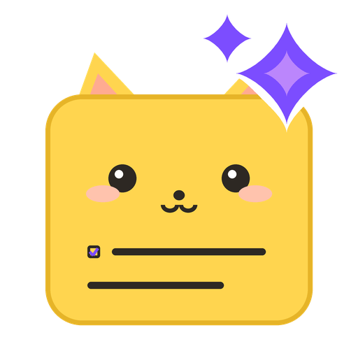
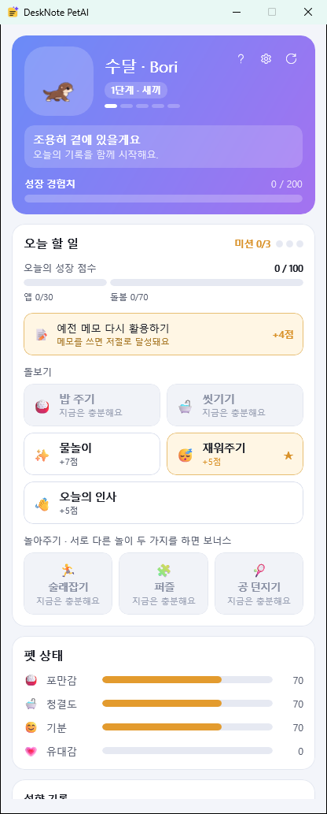
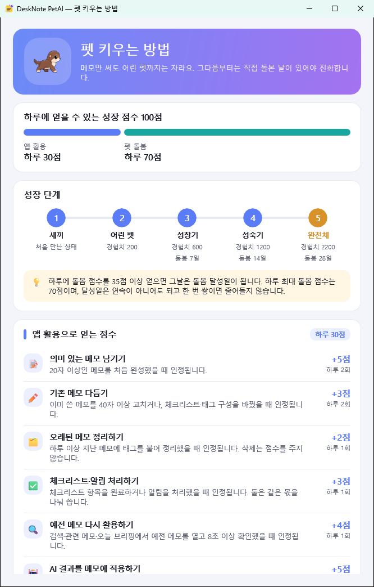
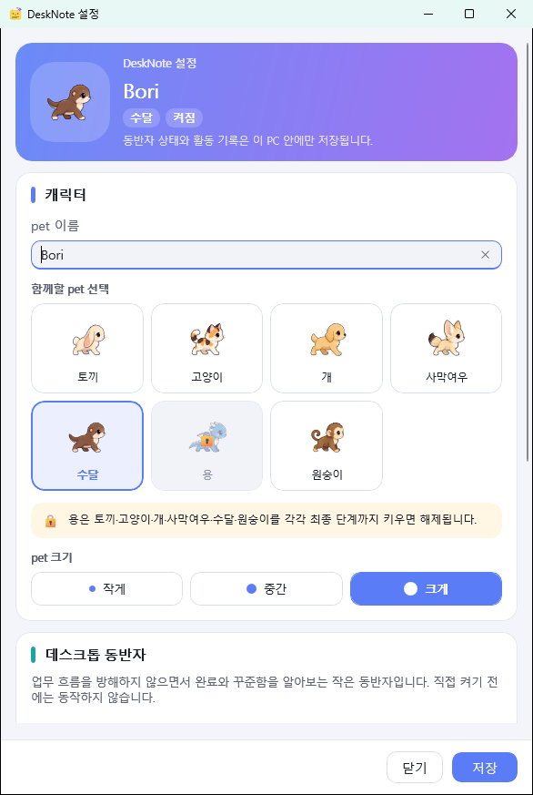
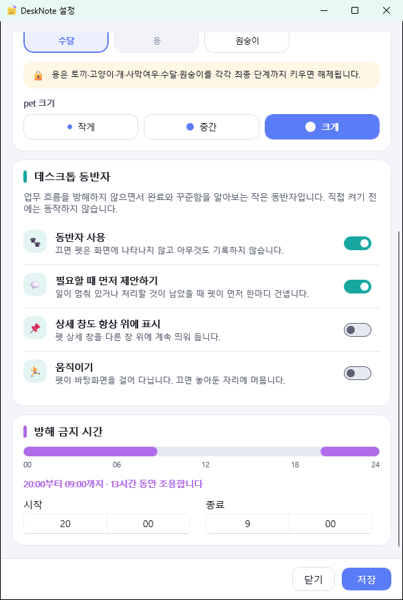

<p align="center">
  
</p>

# DeskNote

**바탕화면에 붙는 스티키 메모. 요약도 검색도 전부 내 PC 안에서.**

[](https://github.com/Ubermensch216/deskNote_petAI/actions/workflows/ci.yml)


떠오른 것을 그 자리에 적고, 쌓인 뒤에는 찾을 수 있고, 필요하면 로컬 AI가 정리해 주는
Windows 메모 앱입니다. 계정도, 구독도, 인터넷도 필요 없습니다.


**바로 가기** ·
[무엇이 다른가](#무엇이-다른가요) ·
[이럴 때 씁니다](#이럴-때-씁니다) ·
[설치하기](#설치하기) ·
[AI 설치와 연결](#ai-설치하고-연결하기) ·
[화면 둘러보기](#화면-둘러보기) ·
[단축키](#단축키) ·
[로컬 AI](#로컬-ai에-대해-알아-둘-것) ·
[내 메모는 어디에](#내-메모는-어디에-있나요) ·
[문제가 생기면](#문제가-생기면) ·
[개발 환경 만들기](#개발-환경-만들기) ·
[FAQ](#자주-묻는-것)

---

## 무엇이 다른가요

| | |
|---|---|
| **메모가 먼저입니다** | AI는 어느 단계에서도 필수가 아닙니다. 모델을 받지 않아도 메모·검색·알림은 100% 동작하고, 모델을 지워도 메모는 그대로입니다. |
| **밖으로 나가지 않습니다** | 요약·재작성·질문은 이 PC의 [Ollama](https://ollama.com)에서 돕니다. 인사 자료든 계약서 초안이든 회사 코드든 네트워크로 나가는 경로 자체가 없습니다. |
| **창이 아니라 종이입니다** | 쉬고 있는 메모에는 버튼이 하나도 보이지 않습니다. 포인터를 올리면 그때 조작 요소가 나타납니다. |
| **잃어버리지 않습니다** | 타이핑이 멈추고 300ms 뒤 자동 저장, 덮어쓰기 전 본문은 기록에 남습니다. 강제 종료 5회 실험에서도 DB 손상 0건이었습니다. |
| **한국어로 잘 찾습니다** | 키워드 검색과 의미 검색을 같이 돌립니다. "결제"라고 적지 않은 메모도 "페이먼트 모듈"로 찾아냅니다. |
| **성장은 선택입니다** | 트레이의 설정에서 데스크톱 펫을 직접 켤 수 있습니다. 메모 활동과 돌봄으로 펫이 자라지만, 안 켜면 창·타이머·활동 기록이 전혀 생기지 않습니다. |

---

## 이럴 때 씁니다

### 1. 회의 중에는 받아적기만, 정리는 끝나고

회의 중에 예쁘게 쓸 시간은 없습니다. 들리는 대로 적어 두고, 끝나면 `✨ AI → 요약` 한 번.
원본과 제안을 나란히 보고 **적용**을 눌러야 본문이 바뀝니다. 마음에 안 들면 버리면 되고,
적용한 뒤에도 `Ctrl+Z` 와 기록으로 되돌아갑니다.


`할 일` 을 고르면 본문에서 해야 할 것만 뽑아 체크박스로 붙여 주고, 마감이 적혀 있으면
그 시각에 알림까지 걸어 줍니다.

### 2. "그거 어디에 적었더라"

`Ctrl+Space` 를 누르고 기억나는 대로 씁니다. 결과는 **모델을 기다리지 않고** 바로 나옵니다.
적어 둔 단어가 정확히 기억나지 않아도 됩니다 — "결제 재시도 정책"으로 찾으면
"페이먼트 모듈"이라고 적힌 메모가 함께 올라옵니다.


같은 한 줄로 **질문**하거나, **알림**을 만들거나, 그 문장으로 **새 메모**를 시작할 수도 있습니다.

### 3. 잊으면 안 되는 일

메모의 `⋯ → 알림` 에서 10분 뒤·1시간 뒤·내일 아침을 고르거나, `직접` 에 한 줄로 씁니다.
**만들기 전에 무엇으로 읽었는지 보여 줍니다** — 엉뚱한 화요일에 울리는 알림을 막는 방법은
동의하기 전에 날짜를 전부 보여 주는 것뿐입니다.


### 4. 흩어진 메모를 주제별로

`✨ AI → 관련 메모` 는 지금 메모와 비슷하게 읽히는 메모를 보여 줍니다. 저장할 때 만들어 둔
벡터를 비교할 뿐이라 **모델을 부르지 않고 밀리초 안에** 끝납니다. 충분히 비슷한 메모가 이 메모까지
셋 이상 모이면 **노트북으로 묶기** 가 나타납니다 — 누르면 노트북이 만들어지고 그 메모들이 들어갑니다.


### 5. 아침에 오늘 할 것부터 보기

트레이 아이콘 우클릭 또는 명령 팔레트에서 **오늘 브리핑**. 오늘 울릴 알림, 아직 남은 체크박스,
최근에 고친 메모를 모아 **메모 한 장**으로 만들어 줍니다. 창이 아니라 메모라서 지우고 싶으면
평소처럼 지우면 됩니다.


### 6. 남에게 보내면 안 되는 내용

인사 평가, 계약 조건, 사내 코드, 병원 기록. 클라우드 메모 앱에 붙여넣기 망설여지는 것들이
이 앱의 기본값입니다. AI 창에도 **"이 메모는 이 PC 안에서만 처리됩니다"** 라고 적혀 있고,
그것은 문구가 아니라 구현입니다.

### 7. 업무 흐름을 게임처럼 오래 이어 가기

트레이의 **설정 → 데스크톱 동반자 → 동반자 사용**을 켜면 작은 펫 ‘모리’가 작업 표시줄 위를
걷습니다. 한 번 클릭하면 펫 대시보드가 열리고, 더블 클릭하면 새 메모가 열립니다. 가만히 두면 펫이
이따금 혼잣말을 합니다 — 머리 바로 위 말풍선으로, 조용한 시간대에는 하지 않습니다.

**혼잣말은 종마다 다르고, 종별로 300개씩 있습니다.** 토끼는 귀와 당근과 겁 많음을 이야기하고, 용은
보물과 고대의 기억을, 수달은 조개와 미끄럼틀을 이야기합니다. 섞은 카드를 한 장씩 넘기는 방식이라
300개를 다 쓴 뒤에야 같은 말이 돌아옵니다 — 무작위로 뽑으면 300개를 갖고도 한나절이면 같은 농담을
두 번 보게 됩니다. 한국어와 영어는 번역이 아니라 각각 따로 썼습니다.

대시보드는 위에서 아래로 세 가지만 묻습니다.

| | |
|---|---|
| **이 아이는 누구인가** | 펫, 이름, 단계 배지와 다섯 칸짜리 성장 눈금, 지금 하는 말 |
| **지금 무엇을 하면 되나** | 오늘의 미션 진행(●●○), 하루 점수 막대, 그리고 **돌봄 타일** |
| **상태는 어떤가** | 포만감·청결도·기분·유대감 게이지 |



돌봄 타일은 색으로 말합니다. **금색에 ★ 이면 오늘의 미션**(위 사진의 `재워주기`), 회색이면 이미
했거나(`오늘 완료`) 지금은 필요 없는 것(`지금은 충분해요`)이고, 각 타일에 몇 점짜리인지가 적혀
있습니다. 무엇을 눌러야 하는지 읽지 않고도 보입니다.

하루 성장 점수는 100점입니다. 메모를 쓰고 다시 찾고 정리하면 최대 30점, 밥을 주고 씻기고 놀아주면
최대 70점입니다. 메모만 써도 어린 펫까지는 자라지만, 그 위로는 직접 돌본 날이 필요합니다. 포인트를
얻으려고 메모를 반복 클릭하거나 배부른 펫에게 밥을 다시 줘도 중복 보상되지 않고, 하루 인정 상한을
넘으면 더 이상 성장을 재촉하지 않습니다. 규칙 전체는 대시보드 오른쪽 위 `❓` 의 **펫 키우는 방법**에
그림으로 정리돼 있고(그 옆이 `⚙` 설정과 `⟳` 새로고침입니다), 그 숫자는 문서가 아니라 밸런스 코드에서
직접 읽어 옵니다.

며칠 접속하지 않아도 경험치가 줄거나 성장 단계가 내려가지 않습니다. 시간이 지나며 내려가는 것은
포만감·청결도·기분뿐입니다. 제안은 30분 안에 도래하는 알림과 오래 묵은 미완료 항목으로 제한되고,
조용한 시간·전체 화면·발표 모드·편집 직후에는 나타나지 않습니다. 펫 상태와 제안 이력도 메모와 함께
이 PC의 SQLite에만 저장됩니다.

---

## 설치하기

**설치 프로그램이 없습니다. 압축을 풀고 실행하면 그게 설치입니다.** .NET도 Windows App SDK도 따로
깔지 않습니다 — 필요한 런타임 파일이 앱 폴더 안에 함께 들어 있습니다. 설치 과정에서 레지스트리에
남기는 것도 없고(시작 프로그램을 켤 때만 항목 하나가 생깁니다), 지울 때는 폴더를 지우면 됩니다.

AI는 이 단계에서 **필요 없습니다.** 먼저 메모부터 쓰고, 나중에 원하면
[AI 설치하고 연결하기](#ai-설치하고-연결하기)로 가면 됩니다.

전체는 7단계, 처음 하는 사람 기준 10분입니다.

### 0단계 · 내 PC가 조건에 맞는지 (1분)

| 확인할 것 | 확인하는 법 | 필요한 값 |
|---|---|---|
| Windows 버전 | `Win + R` → `winver` 입력 → 확인 | 버전 **1809 이상** (Windows 10 / 11) |
| 시스템 종류 | `Win + I` → 시스템 → 정보 | **64비트 운영 체제, x64 기반 프로세서** |
| 여유 공간 | 앱을 풀어 둘 드라이브 | 약 **500MB** (AI까지 쓸 거면 **+12GB**) |

ARM64 PC(Surface Pro X 등)는 [소스에서 빌드](#개발-환경-만들기)하면 동작하지만, 지금 배포되는
ZIP은 x64 전용입니다.

### 1단계 · 앱 받기

두 가지 방법이 있고, 보통은 **A** 입니다.

<details open>
<summary><b>방법 A — 빌드된 ZIP 내려받기 (권장)</b></summary>

아직 정식 릴리스 페이지가 없어서, 최신 빌드는 CI가 만들어 둔 결과물로 받습니다.
**GitHub 계정으로 로그인해야** 내려받기 단추가 보입니다.

1. [Actions → Build, test, and package](https://github.com/Ubermensch216/deskNote_petAI/actions/workflows/ci.yml)
   를 엽니다.
2. 목록에서 **초록색 체크(✓)가 붙은 `main` 실행** 중 가장 위의 것을 누릅니다.
   빨간 ✕ 는 그 커밋의 빌드가 실패한 것이니 아래로 내려가 초록색을 고릅니다.
3. 열린 페이지 맨 아래 **Artifacts** 의 **`DeskNote-win-x64`** 를 눌러 내려받습니다.
4. 받은 파일 안에 `DeskNote-win-x64.zip`이 들어 있습니다. 즉, **압축을 두 번 풀게 됩니다.**

</details>

<details>
<summary><b>방법 B — 소스에서 직접 빌드</b></summary>

[개발 환경 만들기](#개발-환경-만들기)의 명령을 그대로 따라 하면 마지막에
`dist\DeskNote-win-x64.zip`이 만들어집니다. 그 파일이 방법 A로 받는 것과 같은 물건입니다.
개발 도구를 깔아야 하므로 처음 한 번은 20~30분 걸립니다.

</details>

### 2단계 · 압축 풀기 (여기서 가장 많이 막힙니다)

1. **차단 해제.** 받은 zip을 오른쪽 클릭 → **속성** → 창 아래쪽에 `보안: 이 파일은 다른 컴퓨터에서
   전송되었으며…` 가 보이면 옆의 **차단 해제**에 체크 → **확인**.
   인터넷에서 받은 파일에 Windows가 붙여 두는 표시이고, 이걸 풀지 않으면 실행이 막히거나 조용히
   실패합니다. 그 문구가 없으면 이미 해제된 것이니 넘어갑니다.
2. **압축 풀기.** 오른쪽 클릭 → **압축 풀기** → 폴더 선택.
   `C:\Program Files` 같은 관리자 폴더 말고 `C:\Users\<내이름>\Apps\DeskNote` 처럼
   **쓰기 권한이 있는 곳**에 푸세요. 경로에 한글이 있어도 됩니다.
3. **폴더를 통째로 둡니다.** `DeskNote.exe` 하나만 바탕화면으로 옮기면 실행되지 않습니다 —
   옆에 있는 파일들이 .NET과 Windows App SDK 런타임입니다.
   바탕화면에 두고 싶으면 exe를 오른쪽 클릭 → **바로 가기 만들기** 로 만든 바로 가기만 옮기세요.

> zip 안을 탐색기로 열어 **그 안에서 바로 실행하지 마세요.** 임시 폴더에서 실행돼 실패합니다.
> 반드시 푼 뒤 실행합니다.

### 3단계 · 실행

푼 폴더의 **`DeskNote.exe`** 를 더블클릭합니다. 몇 초 뒤 **빈 메모 한 장**과 **트레이 아이콘**이
나타나면 성공입니다.

- **"Windows의 PC 보호"** 파란 창이 뜨면 → **추가 정보** → **실행**.
  코드 서명 인증서를 아직 붙이지 않아서 뜨는 경고입니다.
- **아무 반응이 없다면** → [Microsoft Visual C++ 재배포 가능 패키지(x64)](https://aka.ms/vs/17/release/vc_redist.x64.exe)를
  설치하고 다시 실행하세요. Windows App SDK가 요구하는 유일한 시스템 구성 요소이고, 대개는 이미
  깔려 있습니다.
- 그래도 안 되면 [문제가 생기면](#문제가-생기면)을 보세요.

### 4단계 · 첫 메모

`Ctrl+Alt+N` — 어느 앱을 쓰고 있든 바탕화면에 빈 메모가 뜹니다. 그냥 쓰면 됩니다.
저장 버튼은 없습니다. 트레이 아이콘을 더블클릭해도 같습니다.

### 5단계 · (선택) AI 켜기

푼 폴더 안의 **`install-ai.bat`을 더블클릭**하면 끝입니다. 무엇을 어떻게 하는지, 직접 설치하는
방법과 문제 해결은 바로 다음 장 [AI 설치하고 연결하기](#ai-설치하고-연결하기)에 있습니다.

건너뛰어도 됩니다. AI 없이도 메모·검색·알림·기록은 100% 동작하고, 나중에 아무 때나 켜도 됩니다.

### 6단계 · 트레이에서 언제든

마지막 메모를 닫아도 앱은 트레이에 남습니다. 더블클릭하면 새 메모,
우클릭하면 새 메모 · 메모 라이브러리 · 오늘 브리핑 · 설정 · Windows 시작 시 실행 · 종료.

PC를 켤 때마다 자동으로 띄우려면 트레이 우클릭 → **Windows 시작 시 실행**을 켭니다.
(현재 사용자의 시작 프로그램에만 등록되고, 관리자 권한은 필요 없습니다.)

### 7단계 · 다시 켜면 어제 그대로

**띄워 둔 메모는 그 자리에 다시 뜹니다.** 종료할 때 화면에 있던 메모와 위치·크기·색이 그대로
복원됩니다. 하나도 열어 두지 않았다면 가장 최근에 쓰던 메모 한 장을 대신 엽니다 — 메모 앱을 켰는데
목록 창부터 뜨는 일은 없습니다.

---

## AI 설치하고 연결하기

### 무엇을 왜 까는가

DeskNote는 모델을 안에 품고 있지 않습니다. 이 PC에서 도는 추론 서버
**[Ollama](https://ollama.com)** 에게 부탁하고, 그 서버가 가진 모델을 씁니다. 그래서 설치할 것은
서버 하나와 모델 둘입니다.

| 무엇 | 기본값 | 설치 후 크기 | 없으면 |
|---|---|---|---|
| 추론 서버 | Ollama (`http://localhost:11434`) | 약 3GB | AI 타일 전체가 비활성 — `로컬 AI 서버가 실행 중이 아닙니다` |
| 대화 모델 | `gemma4:e2b` | 약 6.7GB | AI 타일 전체가 비활성 — `로컬 모델이 없습니다` |
| 임베딩 모델 | `bge-m3` | 약 1.1GB | **의미 검색과 관련 메모만** 빠짐. 나머지 AI는 동작 |

준비물은 **여유 공간 12GB 남짓**, **RAM 8GB 이상**(16GB면 편안), 그리고 **모델을 받는 동안만**
인터넷입니다. 다 받은 뒤로는 완전히 오프라인이고, 메모가 이 PC를 떠나는 경로는 없습니다.

### 방법 1 — 배치 파일 한 번 (권장)

**`install-ai.bat` 을 더블클릭**합니다.

- 앱 ZIP을 풀어 쓴다면 → `DeskNote.exe` 와 **같은 폴더**에 있습니다.
- 소스를 받아 쓴다면 → [`scripts\install-ai.bat`](scripts/install-ai.bat) 입니다.

> 오래된 ZIP에는 이 파일이 없습니다. 그럴 때는 저장소의
> [`scripts/install-ai.bat`](scripts/install-ai.bat) 과
> [`scripts/install-ai.ps1`](scripts/install-ai.ps1) **두 개를 함께** 받아 한 폴더에 두고
> 실행하세요. 배치 파일 혼자서는 동작하지 않습니다.

검은 창이 뜨고 다섯 단계를 순서대로 처리합니다. 관리자 권한은 필요 없습니다(설치 관리자가 한 번
물어볼 수는 있습니다). 이미 되어 있는 단계는 건너뛰므로, **몇 번을 다시 실행해도 안전합니다.**

| 단계 | 하는 일 |
|---|---|
| 1/5 | Ollama가 있는지 확인하고, 없으면 설치 (winget → 실패 시 공식 설치 파일) |
| 2/5 | 로컬 서버가 응답하는지 확인하고, 없으면 띄운 뒤 최대 1분 기다림 |
| 3/5 | 대화 모델 내려받기 (진행률은 Ollama가 직접 표시) |
| 4/5 | 임베딩 모델 내려받기 |
| 5/5 | 서버에 실제로 올라와 있는지 다시 확인하고 결과 요약 |

모델 두 개를 처음 받는 데 회선에 따라 **10~30분**이 걸립니다. 창을 닫으면 중단되고, 다시 실행하면
받다 만 곳부터 이어집니다.

**진단만 하고 싶을 때**는 PowerShell에서 이렇게 부릅니다. 아무것도 설치하지 않고 지금 무엇이
빠졌는지만 알려 줍니다.

```powershell
.\install-ai.bat -CheckOnly
```

그 밖의 옵션: `-Yes`(확인 질문 없이 진행), `-Model <태그>`, `-EmbeddingModel <태그>`,
`-Endpoint <주소>`. 모델 태그를 바꿔 설치했다면 **DeskNote 쪽 설정도 같이 바꿔야 합니다**
([설정 바꾸기](#설정-바꾸기)).

### 방법 2 — 직접 설치

배치 파일이 하는 일과 같습니다. 세 줄이면 끝납니다.

```powershell
winget install --id Ollama.Ollama --exact
```

winget이 없으면 [ollama.com/download/windows](https://ollama.com/download/windows) 에서 설치
파일을 받아 실행합니다. 설치가 끝나면 **새 PowerShell 창을 열고**(PATH가 갱신되어야 합니다) 모델을
받습니다.

```powershell
ollama pull gemma4:e2b
```

```powershell
ollama pull bge-m3
```

받은 뒤 확인:

```powershell
ollama list
```

`gemma4:e2b` 와 `bge-m3:latest` 두 줄이 보이면 됩니다.

### 연결 확인

**설정할 것이 없습니다.** DeskNote의 기본값이 Ollama 기본 설치와 이미 맞춰져 있습니다.

앱을 다시 시작할 필요도 없습니다 — 가용성은 **1분마다 다시 확인**하므로, 모델을 다 받고 잠시
기다리면 AI 타일이 저절로 켜집니다. 확인은 이렇게 합니다.

1. 메모 위에 포인터를 올리고 위쪽 **`✨ AI`** 를 누릅니다.
2. 메뉴 **맨 아래**를 봅니다.
   - `gemma4:e2b · CPU` 처럼 **모델 이름과 실행 위치**가 보이면 연결된 것입니다.
   - 대신 안 되는 이유가 적혀 있으면 그것이 곧 원인입니다 → [문제가 생기면](#문제가-생기면)

메모를 쓰던 도중에 Ollama를 껐다 켜도 됩니다. 앱은 그때마다 알아서 따라옵니다.

> **AI 기능은 한국어 메모를 전제로 만들어졌습니다.** 모델에게 보내는 지시문이 전부 한국어라,
> 표시 언어를 English로 두어도 요약·정리·질문의 품질은 한국어 기준입니다. 메모 기능 자체는 언어와
> 무관하게 동작합니다.

> **AI를 나중에 켰다면** 그동안 쓴 메모에는 의미 색인이 없습니다. 앱이 실행 중일 때 배경에서
> 25개씩 이어서 채우므로, 메모가 많아도 한 번 켜 두면 따라잡습니다. 키워드 검색은 그동안에도
> 전부 정상입니다.

### 설정 바꾸기

기본값을 그대로 쓰면 아무것도 건드릴 필요가 없습니다. 바꿔야 할 때만 보세요.

| 키 | 기본값 | 뜻 |
|---|---|---|
| `ai.enabled` | 켬 | `false` 면 소켓조차 열지 않습니다 |
| `ai.endpoint` | `http://localhost:11434` | 로컬 추론 서버 주소 |
| `ai.model` | `gemma4:e2b` | 요약·재작성·질문에 쓰는 모델 |
| `ai.embeddingModel` | `bge-m3:latest` | 의미 검색·관련 메모용 임베딩 모델 |
| `ai.keepAliveMinutes` | `15` | 모델을 메모리에 유지하는 시간 (0~60, `0`이면 즉시 내림) |

트레이 아이콘 우클릭 → **설정** → **AI** 탭에서 바꿉니다. 저장을 누르면 그 자리에서 적용되고,
버튼 왼쪽에 결과가 나옵니다 — `저장했습니다. · 연결됨 · gemma4:e2b` 처럼 나오면 된 것이고,
`로컬 모델이 없습니다` 가 나오면 모델 이름이 틀렸거나 아직 받지 않은 것입니다.

값이 깨져 있으면 조용히 기본값으로 되돌아갑니다. **AI 설정을 잘못 써서 앱이 못 뜨는 일은 없습니다.**

- **다른 대화 모델로 바꾸려면** `ai.model` 을 바꾸고 그 모델을 `ollama pull` 로 받습니다.
  이름은 [ollama.com/library](https://ollama.com/library) 에 있는 태그 그대로여야 합니다.
- **임베딩 모델만은 다시 시작해야 적용됩니다.** 벡터가 모델별로 저장되어 있고, 검색·관련 메모가
  시작할 때 그 모델을 기준으로 조립되기 때문입니다. 바꾸면 이전 모델로 만든 벡터는 비교에서 빠지고
  배경에서 다시 만들어집니다. 서로 다른 모델의 벡터를 섞어 비교하는 일은 없습니다.
- **`ai.endpoint` 에 다른 PC의 주소를 넣으면** 그 순간부터 메모 본문이 네트워크로 나갑니다.
  이 앱이 "밖으로 나가지 않는다"고 말하는 근거는 이 값이 loopback이라는 것뿐입니다. 설정 화면도
  그 주소를 넣는 순간 경고를 띄웁니다. 바꾸는 것은 가능하지만, 무엇을 포기하는지 알고 바꾸세요.

같은 창의 **일반** 탭에는 표시 언어, **새 메모의 기본 색과 크기**, 메모 저장 위치가 있습니다.
기본 색·크기는 저장한 다음 만드는 메모부터 적용됩니다 — 다시 시작할 필요 없습니다.

### AI를 끄거나 지우려면

그냥 설치하지 않으면 됩니다. 이미 깔았다면 [지우기](#지우기)를 보세요.
설치는 그대로 두고 앱에서만 끄려면 `ai.enabled` 를 `false` 로 둡니다.

---

## 화면 둘러보기

### 메모 한 장


포인터를 올리면 위쪽에 `+` 새 메모 · `✨ AI` · `⋯` 메모 설정 · `✕` 닫기가, 아래쪽에 서식 막대가
나타납니다. 그 사이의 빈 곳은 창을 끄는 손잡이입니다.

**제목 칸은 없습니다 — 본문 첫 줄이 곧 제목입니다.** `# 회의 준비` 는 라이브러리에서 `회의 준비` 로
보입니다. 그 제목이 무엇인지 확인할 곳도 세 군데 있습니다: 빈 메모의 안내 문구, 포인터를 올렸을 때
위쪽 띠 가운데, 그리고 `Alt+Tab`·작업 표시줄의 창 이름.

본문은 Markdown 원문 그대로 저장됩니다. `- [ ]` 로 쓴 체크박스는 `Ctrl+Enter` 로 토글되고,
본문에 `#백엔드` 라고 쓰면 그게 곧 태그입니다.

**강조는 마커가 아니라 서식으로 보입니다.** 굵게·기울임·밑줄·취소선은 편집기에서 실제로 그렇게
그려지고 `**`·`~~` 같은 마커는 숨습니다. 저장되는 것은 여전히 `~~취소선~~` 이라서 검색·AI·기록은
그대로입니다. 반대로 줄 머리의 `- [ ]`·`#`·`1.` 은 계속 글자로 보입니다 — 체크박스 토글과 제목
추출이 읽는 것이 바로 그 글자이기 때문입니다.

붙여넣거나 끌어다 놓은 **이미지는 메모 위에 그림으로 그려집니다.** 본문에 파일 경로가 끼어들지
않습니다. 포인터를 올리면 오른쪽 위에 `✕` 가 나타나 그 이미지만 떼어낼 수 있고, 이미지를 누르면
기본 사진 뷰어로 열립니다.

### `✨ AI` — 본문에 대한 것


| 묶음 | 타일 |
|---|---|
| 다듬기 | 요약 · 정리 · 제목 |
| 재작성 | 간결 · 격식 · 친근 · 보고서 |
| 뽑아내기 | 할 일 · 태그 |
| 그 밖 | 관련 메모 · 질문 |

텍스트를 선택해 두면 그 부분만, 선택이 없으면 메모 전체가 대상입니다.
메뉴 맨 아래에는 지금 어떤 모델이 어디서(CPU·GPU) 도는지가 적혀 있고, 모델이 없으면
타일이 비활성인 이유가 그 자리에 적힙니다.

### `⋯` — 메모라는 물건에 대한 것


색상 8종, 불투명도, 크기, 알림, 항상 위에 두기, 메모 라이브러리, 기록, 삭제.
색상·불투명도·항상 위·크기는 메모마다 저장되므로 다시 켜도 그대로 뜹니다.

### 메모 라이브러리


전체 메모를 노트북·태그로 좁혀 보고, 검색창에 입력하면 결과가 바로 나옵니다.
행을 한 번 누르면 그 메모가 바탕화면에 뜹니다.

- **노트북** — 사이드바 `노트북` 옆의 `＋` 새로 만들기 · `✎` 이름 변경 · `🗑` 삭제. 노트북을 지워도
  **안에 있던 메모는 지워지지 않고** 노트북에서만 빠집니다.
- **옮기기** — 메모를 여러 개 고른 뒤 `노트북으로 이동`. `노트북 없음`을 골라 빼낼 수도 있습니다.
- **새로고침** — 다른 창에서 메모를 고치면 목록이 알아서 따라옵니다. 행을 선택해 둔 동안에는 선택이
  풀리지 않도록 자동 갱신을 멈추므로, 그때는 검색창 옆 `⟳` 를 누르면 됩니다.

> **삭제는 되돌릴 수 없습니다.** 휴지통(삭제된 메모) 단계가 없습니다. 메모를 지우면 기록과 첨부까지
> 그 자리에서 사라지므로, 메모 창의 `⋯ → 삭제` 와 라이브러리의 `선택 삭제` 는 모두 한 번 더 묻습니다.

### 펫 키우는 방법

대시보드 오른쪽 위 `❓`. 하루 100점을 어떻게 나눠 갖는지, 다섯 단계가 무엇을 요구하는지, 어떤 행동이
몇 점인지를 한 화면에 그림으로 보여 줍니다.



여기 적힌 숫자는 문서에 옮겨 적은 것이 아니라 **밸런스 코드에서 직접 읽어 옵니다.** 규칙을 조정하면
안내가 따라 바뀌고, 낡은 숫자를 말하는 일이 구조적으로 생기지 않습니다.

### 설정

트레이 우클릭 `설정`, 또는 대시보드 오른쪽 위 `⚙`. **설정도 게임 화면입니다** — 대시보드와 같은
히어로 띠에 지금 고른 펫이 서 있고, 이름·종·크기를 바꾸면 저장하기 전에 그 자리에서 바뀝니다.

<table>
<tr>
<td></td>
<td></td>
</tr>
</table>

- **펫** — 일곱 마리가 초상화로 깔려 있어 목록을 열어 보지 않아도 무엇을 가졌는지 보입니다.
  아직 잠긴 용은 초상화 위에 자물쇠가 붙습니다.
- **크기** — `작게 · 중간 · 크게`. 고르면 히어로 띠의 펫이 그 크기로 바뀝니다.
- **동작** — 동반자 사용 · 먼저 제안하기 · 상세 창 항상 위 · 움직이기. 각 스위치 옆에 켰을 때
  무슨 일이 생기는지가 한 줄로 적혀 있고, `동반자 사용`을 끄면 나머지 셋과 방해 금지 시간이
  흐려집니다 — 동반자가 꺼진 채로는 의미가 없는 값들이기 때문입니다.
- **방해 금지 시간** — 하루를 가로지르는 띠로 그려집니다. `20:00 → 09:00` 처럼 자정을 넘는 구간은
  **양쪽 끝**이 칠해지는데, 시계 두 개로는 보이지 않던 것입니다.

`저장`은 아래에 고정돼 있습니다. 바꾼 것을 저장하려고 페이지 끝까지 스크롤할 일은 없습니다.

### 메모에 질문


`Ctrl+Space` 또는 AI 메뉴의 `질문`. 마지막으로 쓰던 메모가 있으면 그 메모만 근거로 답하고,
없으면 라이브러리에서 관련 메모를 찾아 답합니다. **답 아래에 근거로 쓴 메모가 붙습니다** —
이 크기의 로컬 모델은 틀릴 때가 있고, 틀렸는지 확인할 수 있어야 쓸 수 있기 때문입니다.

### 기록


덮어쓰기 전의 본문이 남습니다. 언제, 무엇 때문에(직접 편집 / AI · 요약) 바뀌었는지와 그때의 본문,
그리고 **복원**. 복원 자체도 기록에 남으므로 잘못 복원한 것도 되돌릴 수 있습니다.

---

## 단축키

### 어디서나 (전역)

| 키 | 동작 |
|---|---|
| `Ctrl+Alt+N` | 새 메모 |
| `Ctrl+Shift+F` | 메모 라이브러리 |
| `Ctrl+Space` | 명령 팔레트 (검색 · 질문 · 알림 · 새 메모 · 브리핑) |
| `Ctrl+Shift+P` | 마지막 메모 항상 위 토글 |
| `Ctrl+Shift+R` | 마지막 메모에 1시간 뒤 알림 |

다른 앱이 이미 그 조합을 쓰고 있으면 등록에 실패하고 로그에 남습니다.
`Ctrl+Space` 는 한국어 IME도 원하는 조합이라 AI가 꺼져 있으면 아예 등록하지 않습니다.

### 메모를 쓰는 중

| 키 | 동작 |
|---|---|
| `Ctrl+B` / `Ctrl+I` | 굵게 / 기울임 |
| `Ctrl+U` / `Ctrl+Shift+X` | 밑줄 / 취소선 |
| `Ctrl+Shift+K` | 인라인 코드 |
| `Ctrl+K` | 링크 |
| `Ctrl+1` / `Ctrl+2` / `Ctrl+3` | 제목 1·2·3 |
| `Ctrl+Shift+L` | 글머리 목록 |
| `Ctrl+Shift+C` | 체크리스트 |
| `Ctrl+Enter` | 커서 줄의 체크박스 토글 |
| `Enter` | 목록 안에서 다음 항목 이어쓰기 (빈 항목에서 목록 종료) |

이미지는 붙여넣기·끌어다 놓기·서식 막대의 이미지 단추 모두 됩니다. 10MB 이하 이미지는 메모 폴더로
복사하고, 큰 파일은 원본 위치를 링크합니다. 어느 쪽이든 **메모 위에는 그림으로 보입니다.**
이미지가 아닌 파일(PDF·스프레드시트 등)만 본문에 링크 한 줄로 들어갑니다.

---

## 로컬 AI에 대해 알아 둘 것

**빠르지 않습니다.** i7 / 16GB CPU에서 gemma4:e2b 기준으로 요약 약 25초, 할 일 추출 약 45초가
걸립니다. 모델이 메모리에 올라와 있지 않은 첫 호출은 1분에 가깝습니다. 그래서 이 앱은

- 모든 AI 동작을 **취소할 수 있게** 만들었고 (창을 닫으면 추론이 멈춥니다),
- 결과는 **적용하기 전까지 메모에 쓰이지 않으며**,
- 검색과 명령 팔레트는 **모델을 아예 기다리지 않습니다**.


반대로 **관련 메모와 태그 제안은 거의 즉시** 끝납니다. 저장할 때 만들어 둔 벡터를 비교할 뿐
새로 생성하지 않기 때문입니다.

설치와 연결은 [AI 설치하고 연결하기](#ai-설치하고-연결하기)에, 설정 키 목록과 바꾸는 방법은
그 안의 [설정 바꾸기](#설정-바꾸기)에 있습니다. 설정 창이 다루는 것은 데스크톱 동반자뿐이라
AI 값은 아직 `settings` 테이블에서 바꿉니다.

더 자세한 내용(프롬프트 격리, 하이브리드 검색, 긴 메모 처리)은 [docs/ai.md](docs/ai.md)에 있습니다.

---

## 내 메모는 어디에 있나요

```
%LOCALAPPDATA%\DeskNote\notes.db
```

첨부한 이미지는 같은 폴더에, 로그는 `logs\desknote.log` 에 남습니다.
백업은 앱을 종료한 뒤 `DeskNote` 폴더를 통째로 복사하면 됩니다.

> **OneDrive·Dropbox 같은 동기화 폴더에 두지 마세요.** SQLite WAL 파일을 파일 단위로
> 동기화하면 손상될 수 있습니다. 기기 간 동기화는 이후 버전에서 다른 방식으로 지원합니다.

**다른 PC로 옮기려면** 새 PC에 앱을 설치([설치하기](#설치하기))한 뒤, 앱을 끈 상태에서 위 폴더를
통째로 덮어쓰면 됩니다. 메모·기록·첨부·펫 상태·설정이 전부 그 폴더 안에 있습니다.

---

## 문제가 생기면

증상별로 원인이 정해져 있습니다. 위에서부터 흔한 순서입니다.

### 앱이 안 뜰 때

| 증상 | 원인 | 해결 |
|---|---|---|
| 더블클릭해도 아무 일이 없다 | Visual C++ 재배포 가능 패키지 없음 | [vc_redist.x64.exe](https://aka.ms/vs/17/release/vc_redist.x64.exe) 설치 후 재실행 |
| "Windows의 PC 보호" 파란 창 | 코드 서명 인증서가 아직 없음 | **추가 정보 → 실행** |
| 잠깐 떴다가 바로 사라진다 | `DeskNote.exe` 만 따로 옮겼거나 압축이 덜 풀림 | 폴더 전체를 다시 풀고, exe는 그 자리에 둔 채 바로 가기만 만들기 |
| 실행이 막힌다 / 파일이 손상됐다고 나온다 | zip **차단 해제**를 안 함 | 원본 zip 오른쪽 클릭 → 속성 → **차단 해제** → 다시 풀기 |
| 32비트 PC라 실행이 안 된다 | 배포본은 x64 전용 | 64비트 Windows가 필요합니다 |

그래도 안 되면 `%LOCALAPPDATA%\DeskNote\logs\desknote.log` 마지막 부분을 확인하세요.

### AI가 안 될 때

먼저 `install-ai.bat` 을 진단 모드(`-CheckOnly`)로 돌리면 아래 셋 중 무엇인지 바로 나옵니다.

| `✨ AI` 메뉴 맨 아래 문구 | 뜻 | 해결 |
|---|---|---|
| `로컬 AI 서버가 실행 중이 아닙니다` | Ollama가 꺼져 있거나 설치되지 않음 | `install-ai.bat` 실행, 또는 `ollama serve` |
| `로컬 모델이 없습니다` | 서버는 살아 있는데 `ai.model` 이 가리키는 모델이 없음 | `ollama pull gemma4:e2b`, 또는 `ai.model` 을 실제 가진 모델 이름으로 |
| `AI를 꺼 두었습니다` | `ai.enabled` 가 `false` | [설정 바꾸기](#설정-바꾸기)에서 `true` 로 |

| 그 밖의 증상 | 원인 | 해결 |
|---|---|---|
| 요약이 30초 넘게 걸린다 | 정상입니다 (CPU 추론) | [로컬 AI에 대해 알아 둘 것](#로컬-ai에-대해-알아-둘-것) |
| 첫 호출만 유독 느리다 | 모델을 메모리에 올리는 중 | `ai.keepAliveMinutes` 를 늘리면 다음 호출부터 빠릅니다 |
| 의미 검색만 안 맞는다 | 임베딩 모델이 없거나 색인이 덜 됨 | `ollama pull bge-m3` 후, 앱을 켜 두면 배경에서 채워집니다 |
| 모델을 받다가 멈춘다 | 회사 프록시·방화벽 | 다시 실행하면 이어서 받습니다. 계속 막히면 네트워크 정책을 확인하세요 |

### 그 밖에

| 증상 | 원인 | 해결 |
|---|---|---|
| `Ctrl+Alt+N` 이 안 먹는다 | 다른 앱이 그 조합을 먼저 잡음 | 그 앱의 단축키를 바꾸거나, 트레이 아이콘을 더블클릭 |
| `Ctrl+Space` 가 안 먹는다 | AI가 꺼져 있으면 아예 등록하지 않습니다 (한국어 IME 배려) | AI를 켜면 등록됩니다 |
| 메모가 하나도 안 보인다 | 다른 데이터 폴더로 실행됨 | `--data` 인자나 `DESKNOTE_DATA` 환경 변수가 걸려 있는지 확인 |
| 지운 메모를 되살리고 싶다 | 휴지통 단계가 없습니다 | 백업본(`DeskNote` 폴더 복사본) 외에는 방법이 없습니다 |

---

## 지우기

**1. 앱** — 먼저 트레이 우클릭 → `Windows 시작 시 실행`을 끄고 종료한 뒤, 압축을 풀었던
폴더를 삭제합니다. 설치 프로그램이 없으므로 제거 프로그램도 없습니다.
자동 실행을 끄지 않고 폴더부터 지웠다면 레지스트리
`HKEY_CURRENT_USER\Software\Microsoft\Windows\CurrentVersion\Run` 의 `DeskNote` 값이 남습니다.

**2. 메모와 설정** — `%LOCALAPPDATA%\DeskNote` 폴더를 삭제합니다.
**여기에 메모 전부가 들어 있고, 지우면 되돌릴 수 없습니다.** 남길 생각이 조금이라도 있으면
먼저 다른 곳으로 복사해 두세요.

**3. AI** — 설정 → 앱 → 설치된 앱에서 **Ollama** 를 제거하고, 모델이 담긴
`%USERPROFILE%\.ollama` 폴더를 삭제합니다(수 GB). 이 폴더는 Ollama를 제거해도 남습니다.

---

## 자주 묻는 것

**AI 없이 써도 되나요?** 네. 모델을 받지 않으면 AI 타일만 비활성이 되고 메모·검색·알림·기록은
전부 그대로입니다. 그렇게 쓰는 것이 이 앱의 설계 전제입니다.

**인터넷이 필요한가요?** 아니요. 모델을 받을 때만 필요하고, 그 다음부터는 완전히 오프라인입니다.

**메모 내용이 모델에게 어떻게 전달되나요?** 본문은 **데이터이지 지시가 아닙니다.** 항상 시스템
프롬프트가 아니라 사용자 메시지의 격리 블록 안에 들어가고, 본문이 그 구분자를 흉내 내면 지웁니다.

**한국어 UI인가요?** Windows 로케일을 따릅니다. 한국어와 영어를 지원하며 `ui.locale` 로 바꿀 수 있습니다.

**메모를 잃어버릴 일은 없나요?** 자동 저장은 300ms, 덮어쓰기 전 본문은 메모당 50개까지 기록에
남습니다. 쓰기 중 강제 종료 5회 실험에서 DB 무결성 검사는 매번 통과했습니다.

**삭제한 메모는 되살릴 수 있나요?** 아니요. 휴지통 단계가 없어 삭제는 그 자리에서 끝나고 기록과
첨부도 함께 사라집니다. 그래서 삭제는 메모 창에서도 라이브러리에서도 한 번 더 묻습니다. 실수로
지웠다면 남는 방법은 백업(`DeskNote` 폴더 복사본)뿐입니다.

**노트북을 지우면 안의 메모도 지워지나요?** 아니요. 노트북에서만 빠지고 메모는 그대로 남습니다.

**얼마나 무겁나요?** 메모 8개를 띄운 채 60초 동안 idle CPU 0.026%, 메모리 159MB.
메모 10,000개를 넣은 DB가 14.6MB입니다.

---

## 개발 환경 만들기

새 PC에서 **소스로부터** 빌드하려는 경우입니다. 앱을 쓰기만 할 거라면 [설치하기](#설치하기)로
충분합니다.

**Visual Studio는 필요 없습니다.** WinUI 3의 XAML 컴파일러와 Windows SDK 빌드 도구는 NuGet에서
오고, 앱은 self-contained로 빌드되므로 .NET 런타임이나 Windows App SDK 런타임도 따로 깔지
않습니다. 필요한 것은 아래 둘뿐입니다.

### 1단계 · 도구 설치 (한 번만)

| 도구 | 왜 | 설치 |
|---|---|---|
| Git | 소스를 받기 위해 | `winget install --id Git.Git --exact` |
| .NET SDK 10.0.400 이상 | 빌드·테스트·배포 전부 | `winget install --id Microsoft.DotNet.SDK.10 --exact` |
| Python + Pillow *(선택)* | 앱 아이콘을 다시 그릴 때만 | [python.org](https://www.python.org/downloads/windows/) → `pip install pillow` |

winget이 없으면 [git-scm.com](https://git-scm.com/download/win) 과
[dotnet.microsoft.com](https://dotnet.microsoft.com/download/dotnet/10.0)(SDK x64)에서 받습니다.

설치 후 **새 터미널을 열고** 확인합니다. PATH는 새 창부터 반영됩니다.

```powershell
dotnet --version; git --version
```

`dotnet --version` 이 `10.0.400` 이상이어야 합니다. 버전이 낮으면 `global.json` 이 SDK를 찾지
못해 복원 단계에서 바로 멈춥니다.

### 2단계 · 소스 받기

```powershell
git clone https://github.com/Ubermensch216/deskNote_petAI.git
```

```powershell
cd deskNote_petAI
```

### 3단계 · 빌드하고 실행

```powershell
dotnet build
```

첫 빌드는 NuGet 복원에 몇 분 걸립니다 — Windows App SDK 패키지만 수백 MB입니다. 두 번째부터는
수십 초입니다.

```powershell
dotnet run --project src/DeskNote.App
```

메모 창이 뜨면 개발 환경은 끝난 것입니다.

### 4단계 · 테스트와 배포 패키지

```powershell
dotnet test
```

```powershell
./scripts/publish-win-x64.ps1
```

배포 스크립트는 `dist\DeskNote-win-x64\` 폴더를 만들고, 필수 파일을 확인하고, 실제로 8초간 실행해
시작 중 죽지 않는지 본 뒤 `dist\DeskNote-win-x64.zip` 으로 압축합니다. CI도 같은 스크립트를
씁니다. `install-ai.bat` 은 그 폴더에 함께 복사되므로, 받은 사람은 그것만 눌러 AI를 준비합니다.

> 스크립트 실행이 정책에 막히면(`실행할 수 없습니다`) 이렇게 우회합니다.
> ```powershell
> powershell -ExecutionPolicy Bypass -File .\scripts\publish-win-x64.ps1
> ```

### 개발 중 알아 두면 좋은 것

- **내 실제 메모와 섞이지 않게** 별도 데이터로 띄울 수 있습니다.
  `dotnet run --project src/DeskNote.App -- --data C:\temp\desknote-dev`
  (또는 `DESKNOTE_DATA` 환경 변수). 단일 인스턴스 잠금도 데이터 폴더별이라 평소 쓰던 앱을 끄지
  않아도 됩니다.
- **복원이 락 파일 오류로 실패하면**(`NU1403` 등) `dotnet restore --force-evaluate` 한 번이면
  됩니다. 이 저장소는 `packages.lock.json` 을 커밋합니다.
- **`dotnet test` 가 바로 오류로 끝나면** `global.json` 의 `test.runner` 항목이 지워지지
  않았는지 보세요. xunit.v3은 Microsoft.Testing.Platform 러너가 필요합니다.
- CI가 `dotnet format --verify-no-changes` 를 돌리므로, 커밋 전에 `dotnet format` 을 한 번
  돌려 두면 빌드가 서식으로 실패하지 않습니다.

자세한 배경(단일 exe를 만들지 않는 이유, 아이콘 생성, 문서 이미지 촬영)은
[docs/development.md](docs/development.md)에 있습니다.

---

## 개발자를 위한 문서

| 문서 | 내용 |
|---|---|
| [docs/development.md](docs/development.md) | 빌드 · 테스트 · 실행 파일 만들기 · 아이콘과 문서 이미지 |
| [docs/architecture.md](docs/architecture.md) | 프로젝트 구조 · 저장과 버전 · 검색 · 성능 측정값 |
| [docs/ai.md](docs/ai.md) | 로컬 AI 계층 전체 (프롬프트 · 하이브리드 검색 · 각 기능의 근거) |
| [docs/companion.md](docs/companion.md) | 펫의 성장 규칙 · 돌봄 · 대시보드 · 바탕화면 행동과 대사 |
| [docs/design.md](docs/design.md) | UI가 지금 모양인 이유 |

제품 정의는 [기획 보고서](docs/Windows%20로컬%20AI%20스티키%20위젯%20제품·기술%20기획%20보고서.pdf)를
따릅니다. 핵심 원칙은 보고서 p21의 우선순위입니다: **메모 → 기억 → AI → 자동화**.
