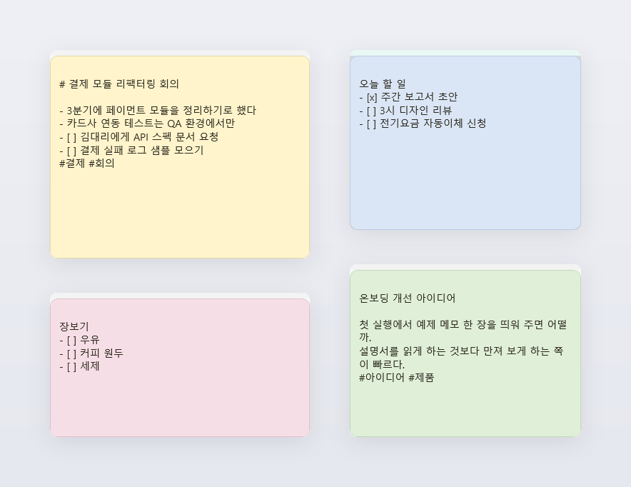
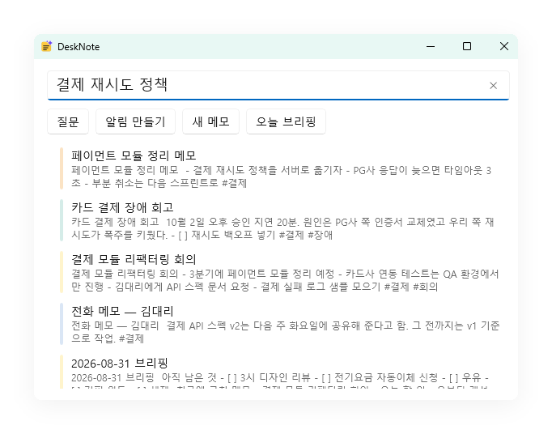
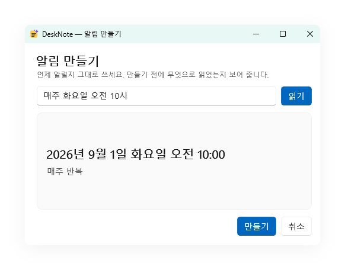
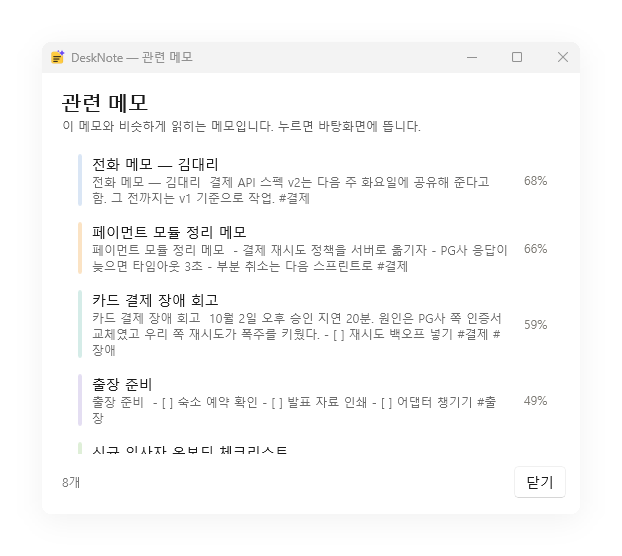
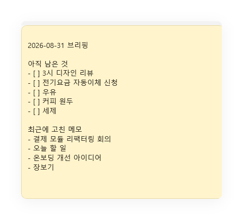
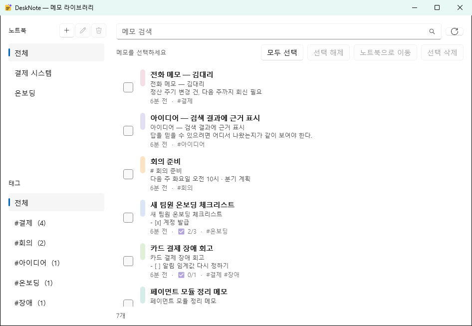
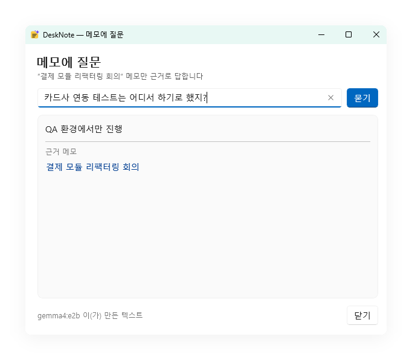
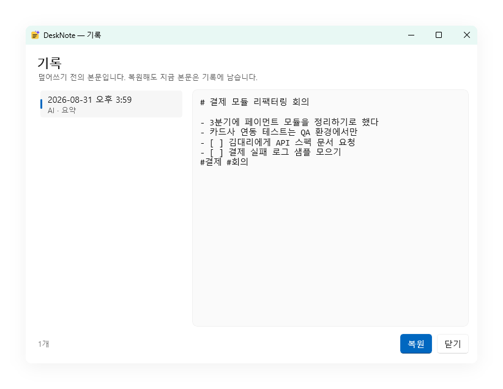

# DeskNote

**바탕화면에 붙는 스티키 메모. 요약도 검색도 전부 내 PC 안에서.**

[](https://github.com/Ubermensch216/deskNote_petAI/actions/workflows/ci.yml)


떠오른 것을 그 자리에 적고, 쌓인 뒤에는 찾을 수 있고, 필요하면 로컬 AI가 정리해 주는
Windows 메모 앱입니다. 계정도, 구독도, 인터넷도 필요 없습니다.



**바로 가기** ·
[무엇이 다른가](#무엇이-다른가요) ·
[이럴 때 씁니다](#이럴-때-씁니다) ·
[5분 시작](#5분이면-시작합니다) ·
[화면 둘러보기](#화면-둘러보기) ·
[단축키](#단축키) ·
[로컬 AI](#로컬-ai에-대해-알아-둘-것) ·
[내 메모는 어디에](#내-메모는-어디에-있나요) ·
[FAQ](#자주-묻는-것)

---

## 무엇이 다른가요

| | |
|---|---|
| **메모가 먼저입니다** | AI는 어느 단계에서도 필수가 아닙니다. 모델을 받지 않아도 메모·검색·알림은 100% 동작하고, 모델을 지워도 메모는 그대로입니다. |
| **밖으로 나가지 않습니다** | 요약·재작성·질문은 이 PC의 [Ollama](https://ollama.com)에서 돕니다. 인사 자료든 계약서 초안이든 회사 코드든 네트워크로 나가는 경로 자체가 없습니다. |
| **창이 아니라 종이입니다** | 쉬고 있는 메모에는 버튼이 하나도 보이지 않습니다. 포인터를 올리면 그때 조작 요소가 나타납니다. |
| **잃어버리지 않습니다** | 타이핑이 멈추고 300ms 뒤 자동 저장, 덮어쓰기 전 본문은 기록에 남습니다. 강제 종료 5회 실험에서도 DB 손상 0건이었습니다. |
| **한국어로 잘 찾습니다** | 키워드 검색과 의미 검색을 같이 돌립니다. "결제"라고 적지 않은 메모도 "페이먼트 모듈"로 찾아냅니다. |
| **성장은 선택입니다** | 트레이의 설정에서 데스크톱 펫을 직접 켤 수 있습니다. 메모 활동과 돌봄으로 펫이 자라지만, 안 켜면 창·타이머·활동 기록이 전혀 생기지 않습니다. |

---

## 이럴 때 씁니다

### 1. 회의 중에는 받아적기만, 정리는 끝나고

회의 중에 예쁘게 쓸 시간은 없습니다. 들리는 대로 적어 두고, 끝나면 `✨ AI → 요약` 한 번.
원본과 제안을 나란히 보고 **적용**을 눌러야 본문이 바뀝니다. 마음에 안 들면 버리면 되고,
적용한 뒤에도 `Ctrl+Z` 와 기록으로 되돌아갑니다.


`할 일` 을 고르면 본문에서 해야 할 것만 뽑아 체크박스로 붙여 주고, 마감이 적혀 있으면
그 시각에 알림까지 걸어 줍니다.

### 2. "그거 어디에 적었더라"

`Ctrl+Space` 를 누르고 기억나는 대로 씁니다. 결과는 **모델을 기다리지 않고** 바로 나옵니다.
적어 둔 단어가 정확히 기억나지 않아도 됩니다 — "결제 재시도 정책"으로 찾으면
"페이먼트 모듈"이라고 적힌 메모가 함께 올라옵니다.



같은 한 줄로 **질문**하거나, **알림**을 만들거나, 그 문장으로 **새 메모**를 시작할 수도 있습니다.

### 3. 잊으면 안 되는 일

메모의 `⋯ → 알림` 에서 10분 뒤·1시간 뒤·내일 아침을 고르거나, `직접` 에 한 줄로 씁니다.
**만들기 전에 무엇으로 읽었는지 보여 줍니다** — 엉뚱한 화요일에 울리는 알림을 막는 방법은
동의하기 전에 날짜를 전부 보여 주는 것뿐입니다.



### 4. 흩어진 메모를 주제별로

`✨ AI → 관련 메모` 는 지금 메모와 비슷하게 읽히는 메모를 보여 줍니다. 저장할 때 만들어 둔
벡터를 비교할 뿐이라 **모델을 부르지 않고 밀리초 안에** 끝납니다. 충분히 비슷한 메모가 이 메모까지
셋 이상 모이면 **노트북으로 묶기** 가 나타납니다 — 누르면 노트북이 만들어지고 그 메모들이 들어갑니다.



### 5. 아침에 오늘 할 것부터 보기

트레이 아이콘 우클릭 또는 명령 팔레트에서 **오늘 브리핑**. 오늘 울릴 알림, 아직 남은 체크박스,
최근에 고친 메모를 모아 **메모 한 장**으로 만들어 줍니다. 창이 아니라 메모라서 지우고 싶으면
평소처럼 지우면 됩니다.



### 6. 남에게 보내면 안 되는 내용

인사 평가, 계약 조건, 사내 코드, 병원 기록. 클라우드 메모 앱에 붙여넣기 망설여지는 것들이
이 앱의 기본값입니다. AI 창에도 **"이 메모는 이 PC 안에서만 처리됩니다"** 라고 적혀 있고,
그것은 문구가 아니라 구현입니다.

### 7. 업무 흐름을 게임처럼 오래 이어 가기

트레이의 **설정 → 데스크톱 동반자**를 켜면 작은 펫 ‘모리’가 작업 표시줄 위를 걷습니다. 한 번
클릭하면 펫 대시보드가 열리고, 더블 클릭하면 새 메모가 열립니다. 가만히 두면 펫이 이따금 혼잣말을
합니다 — 머리 바로 위 말풍선으로, 조용한 시간대에는 하지 않습니다.

대시보드는 위에서 아래로 세 가지만 묻습니다.

| | |
|---|---|
| **이 아이는 누구인가** | 펫, 이름, 단계 배지와 다섯 칸짜리 성장 눈금, 지금 하는 말 |
| **지금 무엇을 하면 되나** | 오늘의 미션 진행(●●○), 하루 점수 막대, 그리고 **돌봄 타일** |
| **상태는 어떤가** | 포만감·청결도·기분·유대감 게이지 |

돌봄 타일은 색으로 말합니다. **금색에 ★ 이면 오늘의 미션**, 회색이면 이미 했거나(`오늘 완료`) 지금은
필요 없는 것(`지금은 충분해요`)이고, 각 타일에 몇 점짜리인지가 적혀 있습니다. 무엇을 눌러야 하는지
읽지 않고도 보입니다.

하루 성장 점수는 100점입니다. 메모를 쓰고 다시 찾고 정리하면 최대 30점, 밥을 주고 씻기고 놀아주면
최대 70점입니다. 메모만 써도 어린 펫까지는 자라지만, 그 위로는 직접 돌본 날이 필요합니다. 포인트를
얻으려고 메모를 반복 클릭하거나 배부른 펫에게 밥을 다시 줘도 중복 보상되지 않고, 하루 인정 상한을
넘으면 더 이상 성장을 재촉하지 않습니다. 규칙 전체는 대시보드 오른쪽 위 `❓` 의 **펫 키우는 방법**에
그림으로 정리돼 있고(그 옆이 `⚙` 설정과 `⟳` 새로고침입니다), 그 숫자는 문서가 아니라 밸런스 코드에서
직접 읽어 옵니다.

며칠 접속하지 않아도 경험치가 줄거나 성장 단계가 내려가지 않습니다. 시간이 지나며 내려가는 것은
포만감·청결도·기분뿐입니다. 제안은 30분 안에 도래하는 알림과 오래 묵은 미완료 항목으로 제한되고,
조용한 시간·전체 화면·발표 모드·편집 직후에는 나타나지 않습니다. 펫 상태와 제안 이력도 메모와 함께
이 PC의 SQLite에만 저장됩니다.

---

## 5분이면 시작합니다

### 1. 실행

`DeskNote-win-x64.zip`을 원하는 폴더에 완전히 푼 뒤, 그 안의 `DeskNote.exe`를 실행하면 끝입니다.
설치 과정도, .NET이나 Windows App SDK 설치도 필요 없습니다. 필요한 런타임 파일은 같은 폴더에
들어 있으므로 `DeskNote.exe`만 따로 옮기지 마세요. Windows 10 1809 이상, 64비트.

> 아무 반응이 없다면 [Microsoft Visual C++ 재배포 가능 패키지(x64)](https://aka.ms/vs/17/release/vc_redist.x64.exe)를
> 설치해 보세요. Windows App SDK가 요구하는 유일한 시스템 구성 요소이고, 대개는 이미 깔려 있습니다.
>
> 직접 빌드하려면 [개발 문서](docs/development.md)를 보세요.

### 2. 첫 메모

`Ctrl+Alt+N` — 어느 앱을 쓰고 있든 바탕화면에 빈 메모가 뜹니다. 그냥 쓰면 됩니다.
저장 버튼은 없습니다. 트레이 아이콘을 더블클릭해도 같습니다.

### 3. (선택) AI 켜기

AI 기능을 쓰려면 [Ollama](https://ollama.com)를 설치하고 모델 두 개를 받습니다.

```bash
ollama pull gemma4:e2b
```

```bash
ollama pull bge-m3
```

첫 번째는 요약·재작성·질문에, 두 번째는 의미 검색과 관련 메모에 씁니다.
받지 않으면 그 기능만 비활성으로 표시되고 나머지는 그대로 동작합니다.

### 4. 트레이에서 언제든

마지막 메모를 닫아도 앱은 트레이에 남습니다. 더블클릭하면 새 메모,
우클릭하면 새 메모 · 메모 라이브러리 · 오늘 브리핑 · 설정 · Windows 시작 시 실행 · 종료.

### 5. 다시 켜면 어제 그대로

**띄워 둔 메모는 그 자리에 다시 뜹니다.** 종료할 때 화면에 있던 메모와 위치·크기·색이 그대로
복원됩니다. 하나도 열어 두지 않았다면 가장 최근에 쓰던 메모 한 장을 대신 엽니다 — 메모 앱을 켰는데
목록 창부터 뜨는 일은 없습니다.

---

## 화면 둘러보기

### 메모 한 장


포인터를 올리면 위쪽에 `+` 새 메모 · `✨ AI` · `⋯` 메모 설정 · `✕` 닫기가, 아래쪽에 서식 막대가
나타납니다. 그 사이의 빈 곳은 창을 끄는 손잡이입니다.

**제목 칸은 없습니다 — 본문 첫 줄이 곧 제목입니다.** `# 회의 준비` 는 라이브러리에서 `회의 준비` 로
보입니다. 그 제목이 무엇인지 확인할 곳도 세 군데 있습니다: 빈 메모의 안내 문구, 포인터를 올렸을 때
위쪽 띠 가운데, 그리고 `Alt+Tab`·작업 표시줄의 창 이름.

본문은 Markdown 원문 그대로 저장됩니다. `- [ ]` 로 쓴 체크박스는 `Ctrl+Enter` 로 토글되고,
본문에 `#백엔드` 라고 쓰면 그게 곧 태그입니다.

붙여넣거나 끌어다 놓은 **이미지는 메모 위에 그림으로 그려집니다.** 본문에 파일 경로가 끼어들지
않습니다. 포인터를 올리면 오른쪽 위에 `✕` 가 나타나 그 이미지만 떼어낼 수 있고, 이미지를 누르면
기본 사진 뷰어로 열립니다.

### `✨ AI` — 본문에 대한 것


| 묶음 | 타일 |
|---|---|
| 다듬기 | 요약 · 정리 · 제목 |
| 재작성 | 간결 · 격식 · 친근 · 보고서 |
| 뽑아내기 | 할 일 · 태그 |
| 그 밖 | 관련 메모 · 질문 |

텍스트를 선택해 두면 그 부분만, 선택이 없으면 메모 전체가 대상입니다.
메뉴 맨 아래에는 지금 어떤 모델이 어디서(CPU·GPU) 도는지가 적혀 있고, 모델이 없으면
타일이 비활성인 이유가 그 자리에 적힙니다.

### `⋯` — 메모라는 물건에 대한 것


색상 8종, 불투명도, 크기, 알림, 항상 위에 두기, 메모 라이브러리, 기록, 삭제.
색상·불투명도·항상 위·크기는 메모마다 저장되므로 다시 켜도 그대로 뜹니다.

### 메모 라이브러리



전체 메모를 노트북·태그로 좁혀 보고, 검색창에 입력하면 결과가 바로 나옵니다.
행을 한 번 누르면 그 메모가 바탕화면에 뜹니다.

- **노트북** — 사이드바 `노트북` 옆의 `＋` 새로 만들기 · `✎` 이름 변경 · `🗑` 삭제. 노트북을 지워도
  **안에 있던 메모는 지워지지 않고** 노트북에서만 빠집니다.
- **옮기기** — 메모를 여러 개 고른 뒤 `노트북으로 이동`. `노트북 없음`을 골라 빼낼 수도 있습니다.
- **새로고침** — 다른 창에서 메모를 고치면 목록이 알아서 따라옵니다. 행을 선택해 둔 동안에는 선택이
  풀리지 않도록 자동 갱신을 멈추므로, 그때는 검색창 옆 `⟳` 를 누르면 됩니다.

> **삭제는 되돌릴 수 없습니다.** 휴지통(삭제된 메모) 단계가 없습니다. 메모를 지우면 기록과 첨부까지
> 그 자리에서 사라지므로, 메모 창의 `⋯ → 삭제` 와 라이브러리의 `선택 삭제` 는 모두 한 번 더 묻습니다.

### 메모에 질문



`Ctrl+Space` 또는 AI 메뉴의 `질문`. 마지막으로 쓰던 메모가 있으면 그 메모만 근거로 답하고,
없으면 라이브러리에서 관련 메모를 찾아 답합니다. **답 아래에 근거로 쓴 메모가 붙습니다** —
이 크기의 로컬 모델은 틀릴 때가 있고, 틀렸는지 확인할 수 있어야 쓸 수 있기 때문입니다.

### 기록



덮어쓰기 전의 본문이 남습니다. 언제, 무엇 때문에(직접 편집 / AI · 요약) 바뀌었는지와 그때의 본문,
그리고 **복원**. 복원 자체도 기록에 남으므로 잘못 복원한 것도 되돌릴 수 있습니다.

---

## 단축키

### 어디서나 (전역)

| 키 | 동작 |
|---|---|
| `Ctrl+Alt+N` | 새 메모 |
| `Ctrl+Shift+F` | 메모 라이브러리 |
| `Ctrl+Space` | 명령 팔레트 (검색 · 질문 · 알림 · 새 메모 · 브리핑) |
| `Ctrl+Shift+P` | 마지막 메모 항상 위 토글 |
| `Ctrl+Shift+R` | 마지막 메모에 1시간 뒤 알림 |

다른 앱이 이미 그 조합을 쓰고 있으면 등록에 실패하고 로그에 남습니다.
`Ctrl+Space` 는 한국어 IME도 원하는 조합이라 AI가 꺼져 있으면 아예 등록하지 않습니다.

### 메모를 쓰는 중

| 키 | 동작 |
|---|---|
| `Ctrl+B` / `Ctrl+I` | 굵게 / 기울임 |
| `Ctrl+U` / `Ctrl+Shift+X` | 밑줄 / 취소선 |
| `Ctrl+Shift+K` | 인라인 코드 |
| `Ctrl+K` | 링크 |
| `Ctrl+1` / `Ctrl+2` / `Ctrl+3` | 제목 1·2·3 |
| `Ctrl+Shift+L` | 글머리 목록 |
| `Ctrl+Shift+C` | 체크리스트 |
| `Ctrl+Enter` | 커서 줄의 체크박스 토글 |
| `Enter` | 목록 안에서 다음 항목 이어쓰기 (빈 항목에서 목록 종료) |

이미지는 붙여넣기·끌어다 놓기·서식 막대의 이미지 단추 모두 됩니다. 10MB 이하 이미지는 메모 폴더로
복사하고, 큰 파일은 원본 위치를 링크합니다. 어느 쪽이든 **메모 위에는 그림으로 보입니다.**
이미지가 아닌 파일(PDF·스프레드시트 등)만 본문에 링크 한 줄로 들어갑니다.

---

## 로컬 AI에 대해 알아 둘 것

**빠르지 않습니다.** i7 / 16GB CPU에서 gemma4:e2b 기준으로 요약 약 25초, 할 일 추출 약 45초가
걸립니다. 모델이 메모리에 올라와 있지 않은 첫 호출은 1분에 가깝습니다. 그래서 이 앱은

- 모든 AI 동작을 **취소할 수 있게** 만들었고 (창을 닫으면 추론이 멈춥니다),
- 결과는 **적용하기 전까지 메모에 쓰이지 않으며**,
- 검색과 명령 팔레트는 **모델을 아예 기다리지 않습니다**.


반대로 **관련 메모와 태그 제안은 거의 즉시** 끝납니다. 저장할 때 만들어 둔 벡터를 비교할 뿐
새로 생성하지 않기 때문입니다.

설정은 `settings` 테이블의 값으로 바꿉니다 (전용 설정 화면은 아직 없습니다).

| 키 | 기본값 | 뜻 |
|---|---|---|
| `ai.enabled` | 켬 | `false` 면 소켓조차 열지 않습니다 |
| `ai.endpoint` | `http://localhost:11434` | 로컬 추론 서버 주소 |
| `ai.model` | `gemma4:e2b` | 요약·재작성·질문에 쓰는 모델 |
| `ai.embeddingModel` | `bge-m3:latest` | 검색·관련 메모용 임베딩 모델 |
| `ai.keepAliveMinutes` | `15` | 모델을 메모리에 유지하는 시간 (0~60) |

더 자세한 내용(프롬프트 격리, 하이브리드 검색, 긴 메모 처리)은 [docs/ai.md](docs/ai.md)에 있습니다.

---

## 내 메모는 어디에 있나요

```
%LOCALAPPDATA%\DeskNote\notes.db
```

첨부한 이미지는 같은 폴더에, 로그는 `logs\desknote.log` 에 남습니다.
백업은 앱을 종료한 뒤 `DeskNote` 폴더를 통째로 복사하면 됩니다.

> **OneDrive·Dropbox 같은 동기화 폴더에 두지 마세요.** SQLite WAL 파일을 파일 단위로
> 동기화하면 손상될 수 있습니다. 기기 간 동기화는 이후 버전에서 다른 방식으로 지원합니다.

---

## 자주 묻는 것

**AI 없이 써도 되나요?** 네. 모델을 받지 않으면 AI 타일만 비활성이 되고 메모·검색·알림·기록은
전부 그대로입니다. 그렇게 쓰는 것이 이 앱의 설계 전제입니다.

**인터넷이 필요한가요?** 아니요. 모델을 받을 때만 필요하고, 그 다음부터는 완전히 오프라인입니다.

**메모 내용이 모델에게 어떻게 전달되나요?** 본문은 **데이터이지 지시가 아닙니다.** 항상 시스템
프롬프트가 아니라 사용자 메시지의 격리 블록 안에 들어가고, 본문이 그 구분자를 흉내 내면 지웁니다.

**한국어 UI인가요?** Windows 로케일을 따릅니다. 한국어와 영어를 지원하며 `ui.locale` 로 바꿀 수 있습니다.

**메모를 잃어버릴 일은 없나요?** 자동 저장은 300ms, 덮어쓰기 전 본문은 메모당 50개까지 기록에
남습니다. 쓰기 중 강제 종료 5회 실험에서 DB 무결성 검사는 매번 통과했습니다.

**삭제한 메모는 되살릴 수 있나요?** 아니요. 휴지통 단계가 없어 삭제는 그 자리에서 끝나고 기록과
첨부도 함께 사라집니다. 그래서 삭제는 메모 창에서도 라이브러리에서도 한 번 더 묻습니다. 실수로
지웠다면 남는 방법은 백업(`DeskNote` 폴더 복사본)뿐입니다.

**노트북을 지우면 안의 메모도 지워지나요?** 아니요. 노트북에서만 빠지고 메모는 그대로 남습니다.

**얼마나 무겁나요?** 메모 8개를 띄운 채 60초 동안 idle CPU 0.026%, 메모리 159MB.
메모 10,000개를 넣은 DB가 14.6MB입니다.

---

## 개발자를 위한 문서

| 문서 | 내용 |
|---|---|
| [docs/development.md](docs/development.md) | 빌드 · 테스트 · 실행 파일 만들기 · 아이콘과 문서 이미지 |
| [docs/architecture.md](docs/architecture.md) | 프로젝트 구조 · 저장과 버전 · 검색 · 성능 측정값 |
| [docs/ai.md](docs/ai.md) | 로컬 AI 계층 전체 (프롬프트 · 하이브리드 검색 · 각 기능의 근거) |
| [docs/design.md](docs/design.md) | UI가 지금 모양인 이유 |

제품 정의는 [기획 보고서](docs/Windows%20로컬%20AI%20스티키%20위젯%20제품·기술%20기획%20보고서.pdf)를
따릅니다. 핵심 원칙은 보고서 p21의 우선순위입니다: **메모 → 기억 → AI → 자동화**.
