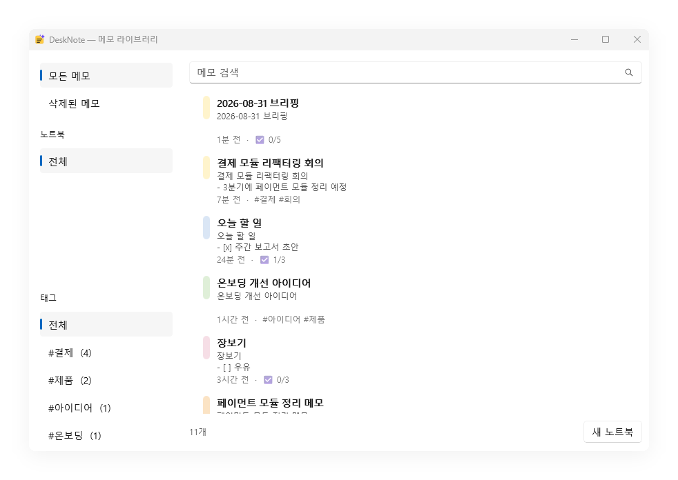

# 구조

제품 정의는 [기획 보고서](Windows%20로컬%20AI%20스티키%20위젯%20제품·기술%20기획%20보고서.pdf)를 따른다.
핵심 원칙은 보고서 p21의 우선순위다: **메모 → 기억 → AI → 자동화**. AI는 어느 단계에서도 메모 앱의
필수 의존성이 되지 않는다. 모델을 받지 않아도 메모 기능은 100% 동작하고, 모델을 지워도 데이터는 온전하다.

## 프로젝트

| 프로젝트 | 대상 | 역할 |
|---|---|---|
| `src/DeskNote.Core` | net10.0 | 도메인 모델, 인터페이스, UI·DB에 의존하지 않는 정책 |
| `src/DeskNote.Data` | net10.0 | SQLite + FTS5, 마이그레이션, 리포지토리 |
| `src/DeskNote.Ai` | net10.0 | `ILocalAiService` 구현 (Ollama HTTP) |
| `src/DeskNote.App` | net10.0-windows | WinUI 3 데스크톱 UI (실행 진입점) |
| `tests/DeskNote.Core.Tests` | net10.0 | 도메인·배치·자동저장 정책 |
| `tests/DeskNote.Data.Tests` | net10.0 | 영속성, 한국어 FTS, 마이그레이션 |
| `tests/DeskNote.Ai.Tests` | net10.0 | 프롬프트 조립, 응답 파싱, 정리 규칙 |
| `tests/DeskNote.Benchmarks` | net10.0 | SLO 측정과 강제 종료 내성 검증 (콘솔 실행 파일) |

의존 방향은 `App → Core ← Data`. `Core`는 아무것도 참조하지 않는다.
AI 계층은 `Core`의 `ILocalAiService` 뒤에만 존재한다. 구현은 `src/DeskNote.Ai`의
`OllamaAiService`이고, 로컬 모델이 없거나 `ai.enabled` 가 꺼져 있으면 항상 "사용 불가"를
반환하는 `NullAiService`로 내려간다.

## 저장과 버전

타이핑이 멈추고 300ms 뒤에 저장이 시작된다(보고서 p5의 250–500ms 대역 중간). 노트마다 타이머가
따로 있어 한 노트에서 치는 동안 다른 노트의 저장이 밀리지 않고, 창이 포커스를 잃거나 닫히거나 앱이
끝날 때는 디바운스를 무시하고 먼저 쓴다.

덮어쓰기 전의 본문은 `note_revisions` 에 남는다. 평범한 타이핑은 5분 간격으로만 체크포인트를
남기고, 본문을 통째로 바꾸는 동작(복구, 일괄 치환, AI 동작)은 항상 먼저 스냅샷을 뜬다.
노트당 50개까지 유지한다.

노트의 `⋯` → **기록** 에서 그 버전들을 본다. 왼쪽에 시각과 출처(`직접 편집` / `AI · 요약`),
오른쪽에 그때의 본문, 아래에 **복원**. 복원 자체도 평범한 본문 쓰기라 지금 본문을 먼저
체크포인트한다 — 잘못 복원하는 것도 되돌릴 수 있다.

AI 적용은 **자동저장 경로를 타지 않는다**. 타이핑은 5분 간격으로 체크포인트하므로, 5분 안에 요약을
두 번 하면 원본이 하나도 남지 않는다 — 보고서 p15 가 요구하는 것의 정반대다. 그래서 AI 적용은
대기 중인 자동저장을 먼저 flush 한 뒤 `BulkReplace` + `RevisionSource.Ai` + 동작 이름으로 직접
쓴다. flush 가 필요한 이유는, 적용 직전에 친 문장이 아직 디바운스 안에 있으면 "AI 이전" 으로
저장되는 버전에 그 문장이 빠지기 때문이다.

## 본문이 원본이다

메모 본문은 Markdown 원문 그대로 저장된다. 체크리스트도 본문 안의 `- [ ]` 가 유일한 원본이며,
`checklist_items` 테이블은 저장 시 본문에서 다시 만들어지는 조회용 투영이다. 밑줄만은 Markdown 문법이
없어 `<u>…</u>` 로 쓴다 — 마커를 새로 발명하면 이 앱을 벗어나는 순간 의미를 잃는다.

태그도 마찬가지다. 본문 안의 `#backend` 가 원본이고 `tags`/`note_tags` 는 투영이다.
Markdown 제목(`# 제목`)과 구분하기 위해 `#` 바로 뒤에 공백이나 `#` 이 오면 태그로 보지 않는다.

제목 칸은 없다. 스티커 메모는 빈 창에 떠오른 생각을 적는 자리라 제목 칸은 거의 언제나 비어 있고,
240×180 노트에서 그 한 줄은 비싸다. 제목은 본문의 첫 줄에서 만들어지며(`NoteContent.DeriveTitle`),
`# 회의 준비` 는 `회의 준비` 가 된다 — 마크업은 그 줄이 무슨 말인지가 아니라 어떻게 보이는지다.

## 라이브러리 검색



메모 라이브러리의 검색은 **두 번 그린다**. 키워드(FTS) 결과가 먼저 뜨고, 약 0.3초 뒤 의미 검색
결과가 도착하면 융합 순위로 다시 그린다. 순서가 바뀌지 않으면 다시 그리지 않으므로, 첫 패스에서
찾은 사용자는 두 번째 패스가 있었다는 것도 모른다. 임베딩 모델이 없으면 두 번째 패스는 아무것도
반환하지 않고 검색은 예전 그대로다 (`HybridLibrarySearch`).

```
검색어: "공직자 임명"   (메모 본문: "장관 후보자 6명 지명 … 국가 AI 전략 총괄 인선")
FTS 결과 0건 · 벡터 결과 1건 → 융합 결과 1건
```

의미 검색은 노트북·태그·삭제 필터를 모른다. 그래서 융합된 순위는 `ListByIdsAsync` 를 거쳐
**순서는 순위에서, 소속은 필터에서** 가져온다 — 벡터가 좋아했지만 지금 필터가 배제한 메모는
사이드바가 부정하는 결과로 보이는 대신 여기서 빠진다.

삭제는 소프트 삭제다. **삭제됨** 범위에서 행을 고르고 **복원** 을 누르면 돌아온다.

## 알림

10분 뒤·1시간 뒤·내일 아침 9시 중에서 고르거나 한 줄로 직접 쓴다. 30초마다 확인하므로
절전/최대 절전에서 깨어난 뒤에도 놓치지 않는다. 반복 알림은 RFC 5545 `RRULE` 의
부분집합(`FREQ=DAILY|WEEKLY|MONTHLY|YEARLY`, `INTERVAL`)을 쓰며, 자리를 비운 사이 지나간 반복은
하나로 합쳐 다음 회차만 알린다.

네 번째 칩 **직접** 은 세 개가 말할 수 없는 것을 위한 것이다 — 요일, 날짜, 반복. `RRULE` 을 만드는
UI가 이제야 생긴 이유는 자리가 없었기 때문이다. 240×180 노트에 반복 편집기를 그릴 데는 없지만
한 줄 입력은 들어간다.

**만들기 전에 읽은 결과를 보여 준다.** "다음 주 화요일" 이 엉뚱한 화요일로 풀리면 그 알림은 틀린
시각에 당당하게 울리고, 그것을 막는 유일한 방법은 동의하기 전에 날짜를 전부 보여 주는 것이다.
읽지 못한 문장은 날짜를 지어내지 않고 아무것도 만들지 않는다.

## 첨부

이미지를 붙여넣으면 메모 폴더로 복사되고, 파일을 끌어다 놓으면 10MB 이하 이미지만 복사하고
나머지는 원본 위치를 링크한다 (보고서 p5: 대용량은 복사보다 링크 우선). 서식 막대의 이미지 단추는
파일 선택 대화상자를 열어 같은 경로를 탄다 — 붙여넣기와 끌어다 놓기는 빠르지만 어느 쪽도 눈에 보이지
않는다. 어느 쪽이든 본문에는 Markdown 참조가 삽입되므로 `Ctrl+Z` 로 되돌릴 수 있다.

## 전역 단축키와 트레이

| 기본 키 | 동작 |
|---|---|
| `Ctrl+Alt+N` | 새 메모 |
| `Ctrl+Shift+F` | 메모 라이브러리 열기 |
| `Ctrl+Shift+P` | 마지막으로 쓰던 메모의 항상 위 토글 |
| `Ctrl+Shift+R` | 마지막으로 쓰던 메모에 1시간 뒤 알림 |
| `Ctrl+Space` | 명령 팔레트 (AI가 꺼져 있지 않을 때만 등록) |

모두 `settings` 테이블의 `input.hotkeys` (명령 이름 → 제스처 JSON) 로 바꿀 수 있다. 전용 설정
화면은 아직 없다. 다른 앱이 이미 그 조합을 쓰고 있어 등록에 실패하면 조용히 넘기지 않고 로그에
남긴다. `Ctrl+Space` 는 한국어 IME도 원하는 조합이라 **`ai.enabled` 가 꺼져 있지 않을 때만**
등록한다 — 호출할 것이 없는 상태에서 시스템 전역으로 뺏지 않는다.

트레이 아이콘은 더블클릭으로 새 메모, 우클릭으로 새 메모 · 메모 라이브러리 · 오늘 브리핑 ·
Windows 시작 시 실행 · 종료를 제공한다. 마지막 메모를 닫아도 여기로 돌아올 수 있다.
아이콘은 실행 파일에 박힌 리소스에서 읽는다 ([development.md](development.md#앱-아이콘)).

## 언어

UI 문자열은 `src/DeskNote.App/Strings/{ko-KR,en-US}/Resources.resw` 에 있다. 기본은 Windows 로케일을
따르고, `settings` 의 `ui.locale` 값으로 수동 전환한다. 하드코딩된 한국어 UI 문자열이 하나라도 생기면
`LocalizationGuardTests` 가 실패한다.

## 성능 측정

Intel i7 / 16GB / SSD, Release 빌드에서 측정한 값:

| 지표 | 목표 | 실측 p95 | |
|---|---|---|---|
| note save (본문 + 체크리스트·태그 투영) | < 30 ms | 1.0 ms | PASS |
| FTS 검색 (한국어) | < 100 ms | 2.5 ms | PASS |
| FTS 검색 (영어) | < 100 ms | 5.3 ms | PASS |
| 시작 시 복원 쿼리 | — | 0.06 ms | PASS |
| 라이브러리 목록 200행 | < 100 ms | 26.4 ms | PASS |
| 라이브러리 검색 | < 100 ms | 2.4 ms | PASS |
| 새 메모 표시 (앱 실측) | < 80 ms | 59.4 ms | PASS |
| idle CPU (메모 8개 열어둔 채 60초) | < 0.5% | 0.026% | PASS |

10,000개 노트의 DB는 14.6 MB, 메모 8개를 띄운 프로세스의 working set은 159 MB.
0.25초마다 메모를 만들고 닫는 버스트에서는 `Window.Activate()` 의 포그라운드 전환 경합으로
p95가 ~540 ms까지 오른다. 사람이 단축키를 누르는 간격에서는 나타나지 않지만 알려진 특성이다.

측정 방법은 [development.md](development.md#성능-측정)에 있다.

## 강제 종료 내성

`tests/DeskNote.Benchmarks` 의 `--crash-writer <db 경로>` 모드로 쓰기 중인 프로세스를 5회 강제 종료한
결과, 매번 `PRAGMA integrity_check = ok`, 외래키 위반 0, 체크리스트·태그 투영 카운트가 노트와 정확히
일치했다. 진행 중이던 쓰기 1건만 본문 없이 남아 트랜잭션 경계가 지켜졌다.

## 데이터 위치

`%LOCALAPPDATA%\DeskNote\notes.db` (WAL). 로그는 `%LOCALAPPDATA%\DeskNote\logs\desknote.log`.

DB를 OneDrive 같은 파일 동기화 폴더에 두지 않는다. WAL 사용 중 파일 단위 외부 동기화는
손상 위험이 있어, 동기화는 이후 note-level operation 복제로 구현한다 (보고서 p6).
