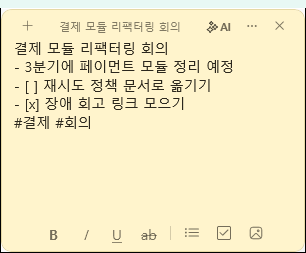
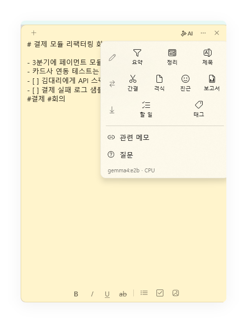
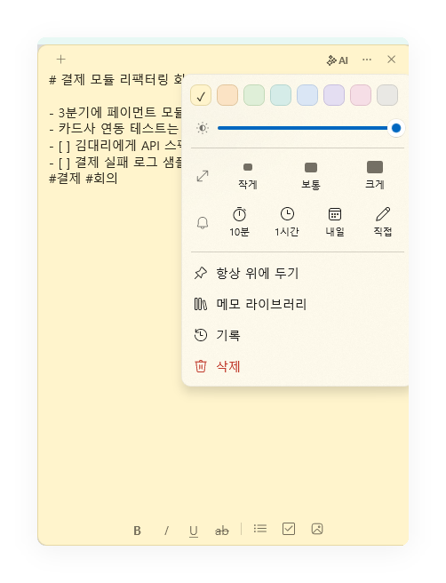
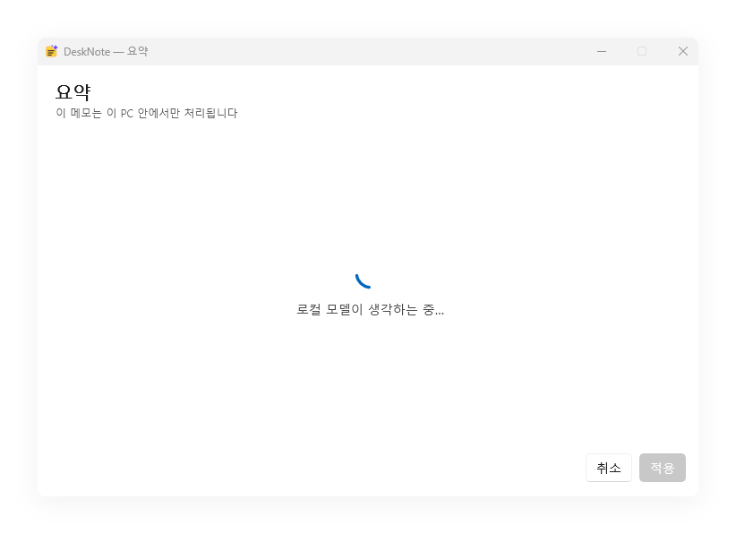
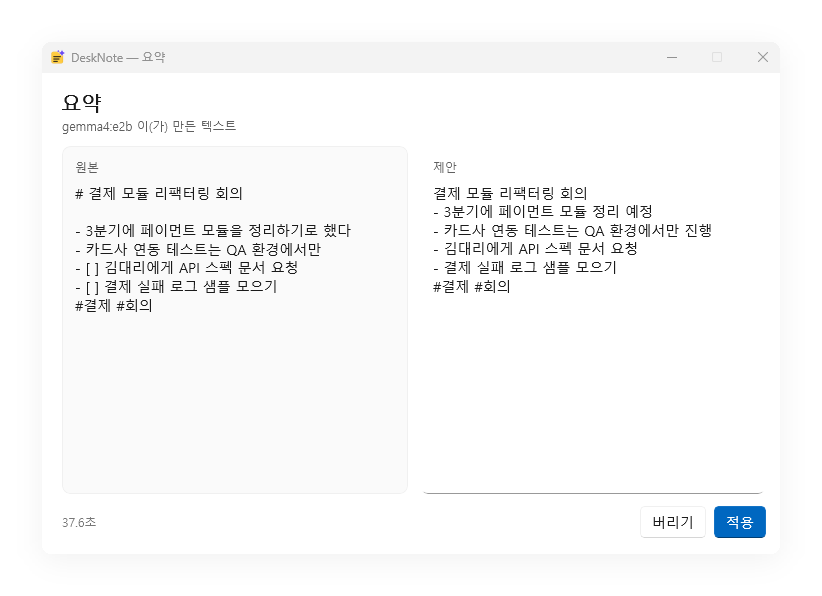
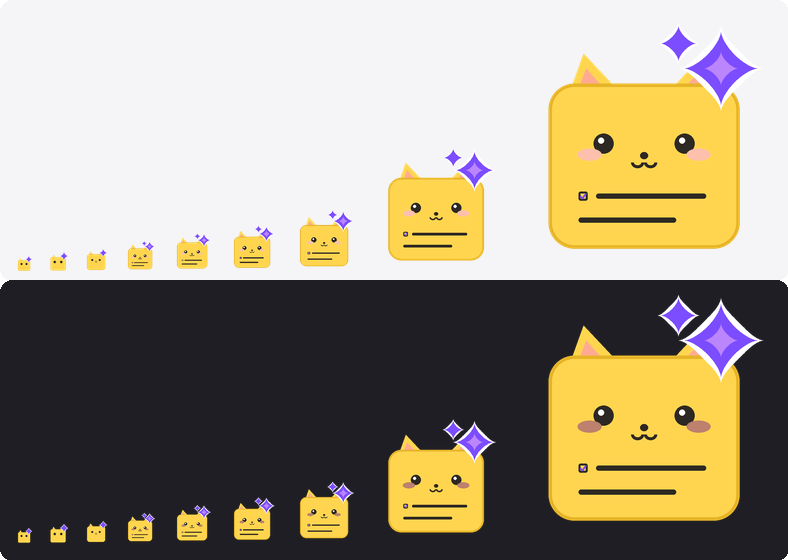

# UI가 지금 모양인 이유

## 메모 모양

쉬고 있는 노트에는 아무 조작 요소도 보이지 않는다. 화면에 있는 것은 글과 그 글이 놓인 종이뿐이고,
포인터가 올라오거나 키보드 포커스가 들어오면 그때 조작 요소가 페이드인한다 (보고서 p4). 자리는 미리
잡아 두므로 나타났다 사라질 때 본문이 다시 흐르지 않는다.

| 위치 | 내용 |
|---|---|
| 위쪽 | `+` 새 메모 · `✨ AI` · `⋯` 메모 설정 · `✕` 닫기, 그 사이는 창을 끄는 손잡이 |
| 아래쪽 | 굵게 · 기울임 · 밑줄 · 취소선 · 글머리 목록 · 체크리스트 · 이미지, 선택 시 `요약` · `간결` 추가 |
| `✨ AI` 메뉴 | 다듬기(요약 · 정리 · 제목) · 재작성(간결 · 격식 · 친근 · 보고서) · 뽑아내기(할 일 · 태그) · 관련 메모 · 질문 |
| `⋯` 메뉴 | 색상 8종 · 불투명도 · 크기 · 알림(10분 · 1시간 · 내일 · 직접) · 항상 위 · 메모 라이브러리 · 기록 · 삭제 |

강조는 마커가 아니라 서식으로 보인다. 본문은 `RichEditBox` 이고 굵게·기울임·밑줄·취소선은 실제로
그렇게 그려진다 — `~~취소선~~` 은 그어진 채로 보이고 물결표는 숨는다. 저장되는 문자열은 그대로이며,
그 경계와 안전 장치는 [architecture.md](architecture.md#보이는-것과-저장되는-것)에 있다. 줄 머리의
`- [ ]`·`#` 은 계속 글자로 보인다 — 체크박스 토글과 제목 추출이 읽는 것이 바로 그 글자다.

서식 명령은 모두 단축키로도 걸려 있지만 `Ctrl+Shift+X`(취소선)와 `Ctrl+Shift+C`(체크리스트)만
`KeyboardAccelerator` 목록이 아니라 `PreviewKeyDown`에서 처리한다. 편집 컨트롤이 `Ctrl+X`·`Ctrl+C`를
Shift와 상관없이 잘라내기·복사로 읽고 가속기 처리 전에 키를 먹어버리기 때문이다. `PreviewKeyDown`은
그보다 먼저 터널링하므로 명령이 실행되고 편집 컨트롤은 키를 보지 못한다 — 목록 이어쓰기용 Enter를
여기서 잡는 것과 같은 이유다. 컨트롤 자체의 `Ctrl+B`·`I`·`U` 는 `DisabledFormattingAccelerators` 로
꺼 둔다. 거의 맞는 일을 하는 두 번째 굵게 명령은 아무것도 없는 것보다 나쁘다 — 둘 중 하나는 서식
막대에 자기가 실행됐다고 알리지 않는다.

붙여넣기는 언제나 글자만 받는다. 브라우저에서 복사한 글을 그대로 받으면 그 페이지의 글꼴·크기·색이
메모 위에 이물질로 얹힌다. 메모의 강조는 메모의 것이다.

숨긴 조작 요소는 opacity만 낮추는 것이 아니라 히트 테스트도 같이 끈다. 보이지 않는데 클릭은 먹는
버튼은 없는 버튼보다 나쁘고, 조작 요소가 죽어 있어야 위쪽 띠 전체가 다시 창을 끄는 손잡이가 된다.

## 메뉴가 둘인 이유

`⋯` 는 **메모라는 물건에 대한 것** 이고 — 무슨 색인지, 얼마나 큰지, 언제 말을 거는지, 어디에
있는지 — `✨ AI` 는 **본문에 대한 것** 이다. AI가 이 앱의 제품이므로 색상 여덟 개 아래로
스크롤해야 나오는 한 구역이 아니라 제 버튼을 갖는다.

<table>
<tr>
<td></td>
<td></td>
</tr>
</table>

두 메뉴는 같은 구조를 쓴다. **왼쪽 26pt 세로줄이 카테고리** 이고, 그 오른쪽에 있는 것이 전부 그
카테고리에 속한다. 세로줄만 내려 읽으면 타일을 하나도 읽기 전에 그 메뉴가 무엇을 하는지 알 수
있다.

| 메뉴 | 세로줄을 내려 읽으면 |
|---|---|
| `✨ AI` | 다듬기 · 재작성 · 뽑아내기 · 관련 메모 · 질문 |
| `⋯` | 불투명도 · 크기 · 알림 · 항상 위 · 라이브러리 · 기록 · 삭제 |

카테고리를 세로줄에 넣기 전에는 `재작성`·`뽑아내기` 가 각각 제 행을 하나씩 차지하는 caption
이었다. 같은 말을 하면서 행을 세 개 더 쓰는 셈이고, 180pt 노트에는 그럴 여유가 없다.

항목은 글자보다 아이콘이 먼저 오게 배치했다. 아이콘 아래의 이름은 남겨 둔다 — 깔때기가 `요약`
이라는 것은 알고 나서야 읽히고, 이름은 아이콘을 가르치는 쪽이며 그 다음부터 메뉴를 훑게 만드는
것은 아이콘이다. `10분`·`1시간`·`내일` 처럼 아이콘이 대신할 수 없는 값은 글자로 남겼다.

메뉴는 열릴 때 노트 크기에 맞춰진다. 패키징하지 않은 WinUI 팝업은 제 창 밖으로 나가지 못하고
잘려 나가므로, 세로는 스크롤로 접고 가로는 폭을 줄여 색상 줄이 두 줄로 감긴다. 180pt 노트에서도
마지막 줄까지 누를 수 있어야 메뉴다.

색상·불투명도·항상 위·크기는 모두 노트마다 저장되므로 다시 켜도 그대로 뜬다. 불투명도에는
하한(`Note.MinOpacity`)이 있어 노트를 완전히 투명하게 만들어 잃어버리는 일은 없다. 아래쪽 서식
막대의 명령은 전부 단축키와 같은 것이며, 막대는 그것을 찾을 수 있게 하고 단축키는 빠르게 한다.

로컬 모델이 없으면 `✨ AI` 메뉴의 타일은 전부 비활성이고 그 자리에 이유가 적힌다. 누를 것이 없다는
사실을 UI에서 그대로 보여주는 편이, 눌렀을 때 실패하는 버튼보다 낫다.

## 제목 칸이 없는 이유

스티커 메모는 빈 창에 떠오른 생각을 적는 자리라 제목 칸은 거의 언제나 비어 있고, 240×180 노트에서
그 한 줄은 비싸다. 제목은 본문의 첫 줄에서 만들어지며(`NoteContent.DeriveTitle`), `# 회의 준비` 는
`회의 준비` 가 된다 — 마크업은 그 줄이 무슨 말인지가 아니라 어떻게 보이는지다.

칸이 없다고 해서 규칙을 숨길 이유는 없다. "제목은 어디서 정하나"는 실제로 나온 질문이고, 답을 문서에
적는 대신 세 곳에서 보여 준다: 빈 메모의 안내 문구가 `첫 줄이 제목이 됩니다`, 포인터를 올리면 위쪽
띠 가운데에 지금 제목이 뜨고, Alt+Tab과 작업 표시줄이 메모를 그 이름으로 부른다. 띠의 제목은 나머지
크롬과 함께 페이드인하며 히트 테스트를 받지 않으므로 그 자리는 여전히 창을 끄는 손잡이다 — 노트가
한 줄도 잃지 않고 답을 얻는다.

## 첨부한 이미지는 이미지로 보인다

본문은 순수한 `TextBox` 다. 사용자의 글은 담을 수 있어도 그림은 그리지 못하므로, 편집기 위에 이미지
스트립을 따로 둔다. 전에는 본문에 Markdown 참조를 써 넣었는데, 그러면 붙여넣은 것은 사진인데 메모에
남는 것은 퍼센트 인코딩된 경로 네 줄이었다.

스트립은 노트 높이의 절반까지만 차지하고, 이미지는 원본 해상도를 넘겨 확대하지 않는다. 제거 버튼은
나머지 크롬과 같은 규칙으로 포인터를 올렸을 때만 나타난다 — 사진 위에서도 읽히도록 종이 색 판 위에
그린다. 텍스트가 아니라 이미지이므로 `Ctrl+Z` 로 되돌릴 것이 없고, 그래서 그 `✕` 가 실행 취소의
자리를 대신한다.

## 기다림을 보여주는 방식

CPU 추론은 수십 초가 걸린다. 그래서 AI 동작은 **미리보기 창이 먼저 뜨고** 결과가 나중에 채워진다.
누른 뒤 30초 동안 아무 일도 일어나지 않으면 사람은 그것을 고장으로 읽는다.

<table>
<tr>
<td></td>
<td></td>
</tr>
</table>

같은 이유로 오늘 브리핑은 **빈 메모를 먼저 띄우고** 내용을 나중에 채우고, Q&A는 답이 오기 전에
근거 메모부터 보여 주고, 명령 팔레트는 검색 결과를 모델과 무관하게 즉시 그린다.

기다리는 화면에는 "이 메모는 이 PC 안에서만 처리됩니다" 가 적혀 있다. 로컬 추론을 고른 이유가
가장 잘 읽히는 순간이 정확히 사용자가 기다리고 있는 그 순간이기 때문이다.

## 되돌릴 수 없는 것만 묻는다

`⋯ → 삭제` 는 예전에 클릭 즉시 실행됐다. 메모가 삭제된 메모로 가고 라이브러리에서 복원할 수 있었으니
그 클릭은 되돌릴 수 있었기 때문이다. 삭제가 즉시·영구가 된 지금은 `항상 위에 두기` 에서 손 한 뼘
떨어진 같은 클릭이 메모와 그 기록을 없앤다. 확인 대화상자가 사라진 휴지통의 자리를 대신한다.

같은 이유로 노트북 삭제 대화상자는 **안의 메모는 지워지지 않는다**고 문장으로 말한다. 휴지통이 없는
앱에서 폴더를 지우는 사람은 안의 일까지 사라질까 걱정하는 것이 당연하고, 그 걱정을 풀어 주는 문장이
그 명령을 쓸 수 있게 만든다.

## 펫 화면

펫 대시보드와 `펫 키우는 방법` 은 자기들끼리 하나의 언어를 쓴다 — 채도 높은 히어로 띠, 앱 활동은
남색, 돌봄은 청록, 목표와 미션은 금색. 게임 화면이 시스템 회색을 빌려 쓰면 동물이 들어 있는 설정
페이지로 읽히고, 사용자는 펫 창에서 안내 창으로 넘어가면서 다른 앱에 온 것처럼 느낀다.

색을 고르는 규칙과 그렇게 정한 이유는 [companion.md](companion.md#대시보드는-세-가지-질문이다)에 있다.

## 앱 아이콘

노란 스티키 메모와 오른쪽 위를 뚫고 나오는 보라색 스파클. "메모"와 "AI" 두 가지만 말한다.

16px 트레이 아이콘은 256px 셸 아이콘을 줄인 것이 아니라 따로 그린다 — 작은 크기에서는 글줄이
두 줄로 줄고 획이 두꺼워지고 작은 스파클이 빠진다. 축소해서 만들면 그 크기에서 전부 뭉개진다.
만드는 방법은 [development.md](development.md#앱-아이콘)에 있다.
